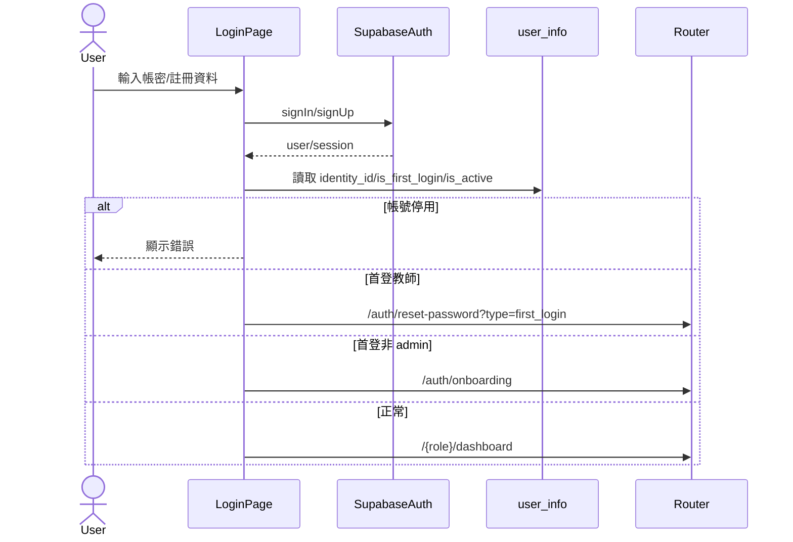
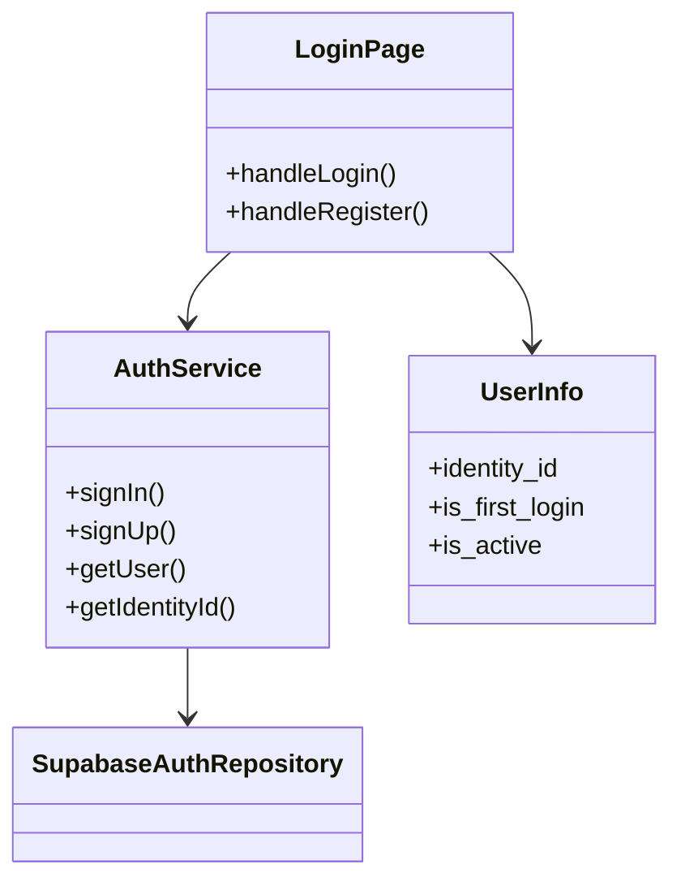
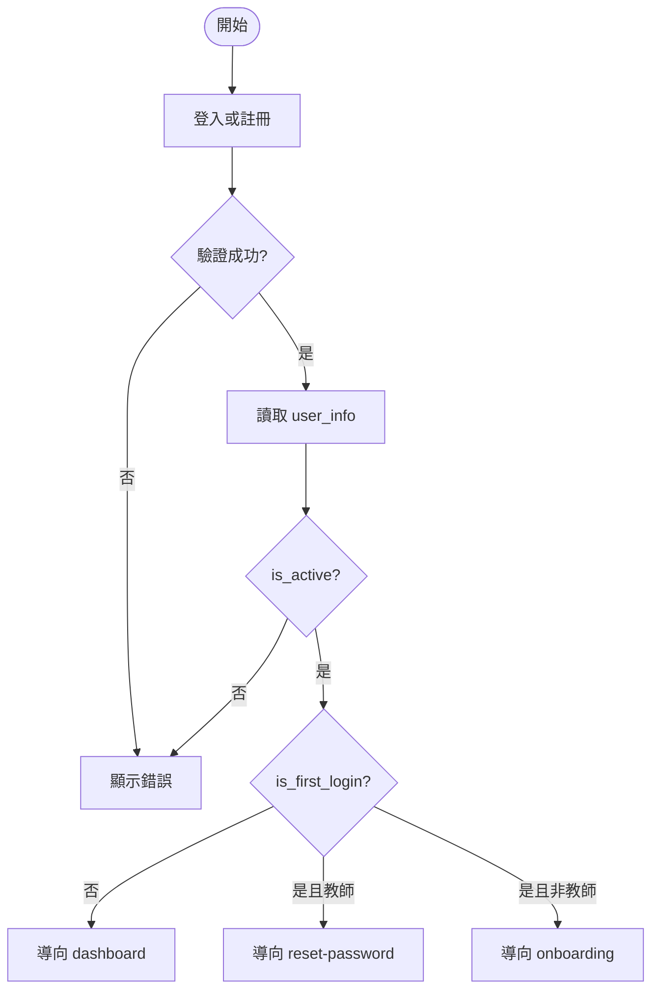
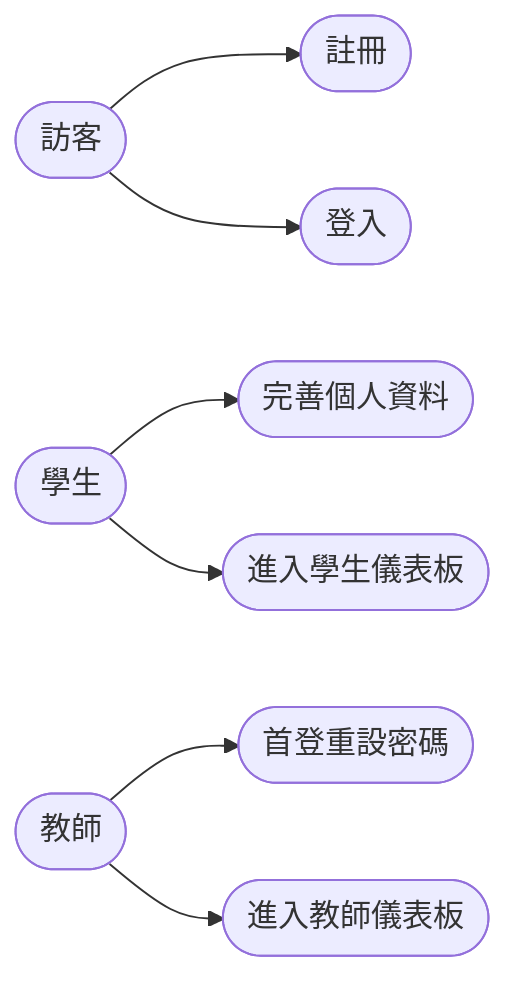

## 1. Auth：登入 / 註冊 / 首登導流

### Sequence Diagram

```mermaid
sequenceDiagram
    actor User
    participant UI as LoginPage
    participant Auth as SupabaseAuth
    participant UInfo as user_info
    participant Router

    User->>UI: 輸入帳密/註冊資料
    UI->>Auth: signIn/signUp
    Auth-->>UI: user/session
    UI->>UInfo: 讀取 identity_id/is_first_login/is_active
    alt 帳號停用
      UI-->>User: 顯示錯誤
    else 首登教師
      UI->>Router: /auth/reset-password?type=first_login
    else 首登非 admin
      UI->>Router: /auth/onboarding
    else 正常
      UI->>Router: /{role}/dashboard
    end
```

### Class Diagram

```mermaid
classDiagram
    class LoginPage {
      +handleLogin()
      +handleRegister()
    }
    class AuthService {
      +signIn()
      +signUp()
      +getUser()
      +getIdentityId()
    }
    class SupabaseAuthRepository
    class UserInfo {
      +identity_id
      +is_first_login
      +is_active
    }

    LoginPage --> AuthService
    AuthService --> SupabaseAuthRepository
    LoginPage --> UserInfo
```

### Activity Diagram

```mermaid
flowchart TD
    A([開始]) --> B[登入或註冊]
    B --> C{驗證成功?}
    C -- 否 --> D[顯示錯誤]
    C -- 是 --> E[讀取 user_info]
    E --> F{is_active?}
    F -- 否 --> D
    F -- 是 --> G{is_first_login?}
    G -- 否 --> H[導向 dashboard]
    G -- 是且教師 --> I[導向 reset-password]
    G -- 是且非教師 --> J[導向 onboarding]
```

### Use Case Diagram

```mermaid
flowchart LR
    Guest([訪客])
    Student([學生])
    Teacher([教師])

    Guest --> UC1(["註冊"])
    Guest --> UC2(["登入"])
    Student --> UC3(["完善個人資料"])
    Teacher --> UC4(["首登重設密碼"])
    Student --> UC5(["進入學生儀表板"])
    Teacher --> UC6(["進入教師儀表板"])
```

