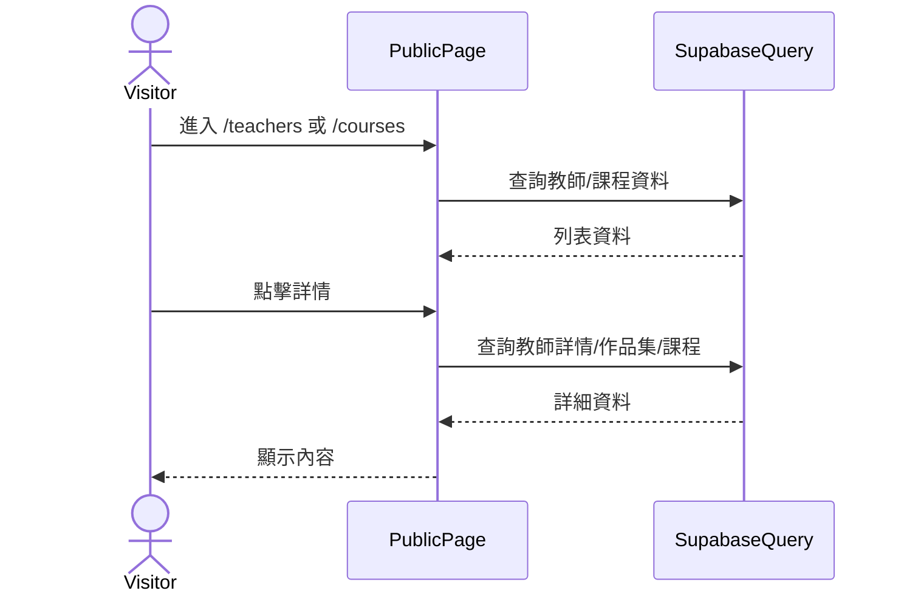
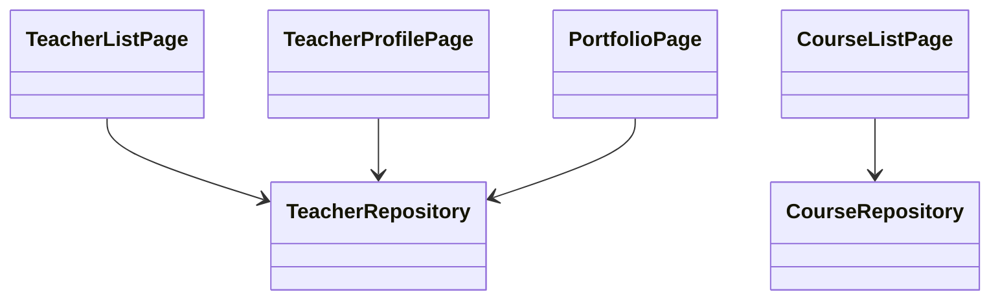
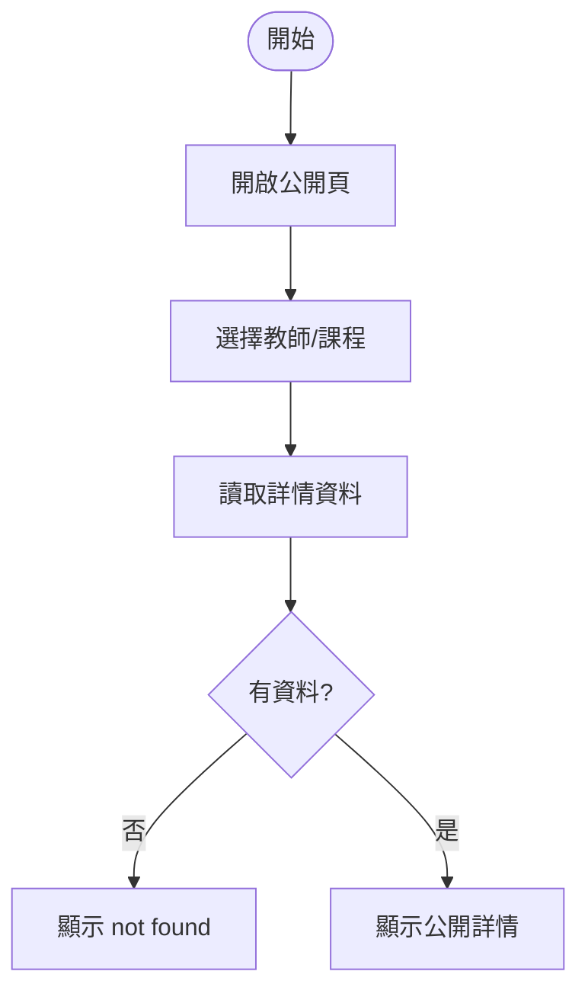
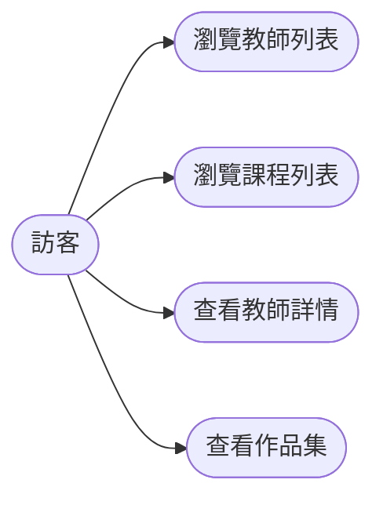

## 2. Public：瀏覽教師/課程/作品集

### Sequence Diagram

```mermaid
sequenceDiagram
    actor Visitor
    participant UI as PublicPage
    participant API as SupabaseQuery

    Visitor->>UI: 進入 /teachers 或 /courses
    UI->>API: 查詢教師/課程資料
    API-->>UI: 列表資料
    Visitor->>UI: 點擊詳情
    UI->>API: 查詢教師詳情/作品集/課程
    API-->>UI: 詳細資料
    UI-->>Visitor: 顯示內容
```

### Class Diagram

```mermaid
classDiagram
    class TeacherListPage
    class CourseListPage
    class TeacherProfilePage
    class PortfolioPage
    class TeacherRepository
    class CourseRepository

    TeacherListPage --> TeacherRepository
    CourseListPage --> CourseRepository
    TeacherProfilePage --> TeacherRepository
    PortfolioPage --> TeacherRepository
```

### Activity Diagram

```mermaid
flowchart TD
    A([開始]) --> B[開啟公開頁]
    B --> C[選擇教師/課程]
    C --> D[讀取詳情資料]
    D --> E{有資料?}
    E -- 否 --> F[顯示 not found]
    E -- 是 --> G[顯示公開詳情]
```

### Use Case Diagram

```mermaid
flowchart LR
    Visitor([訪客])
    Visitor --> UC1(["瀏覽教師列表"])
    Visitor --> UC2(["瀏覽課程列表"])
    Visitor --> UC3(["查看教師詳情"])
    Visitor --> UC4(["查看作品集"])
```

