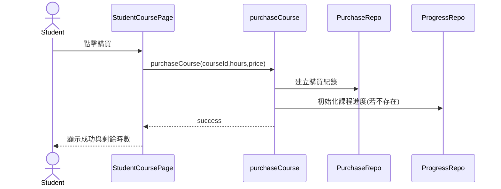
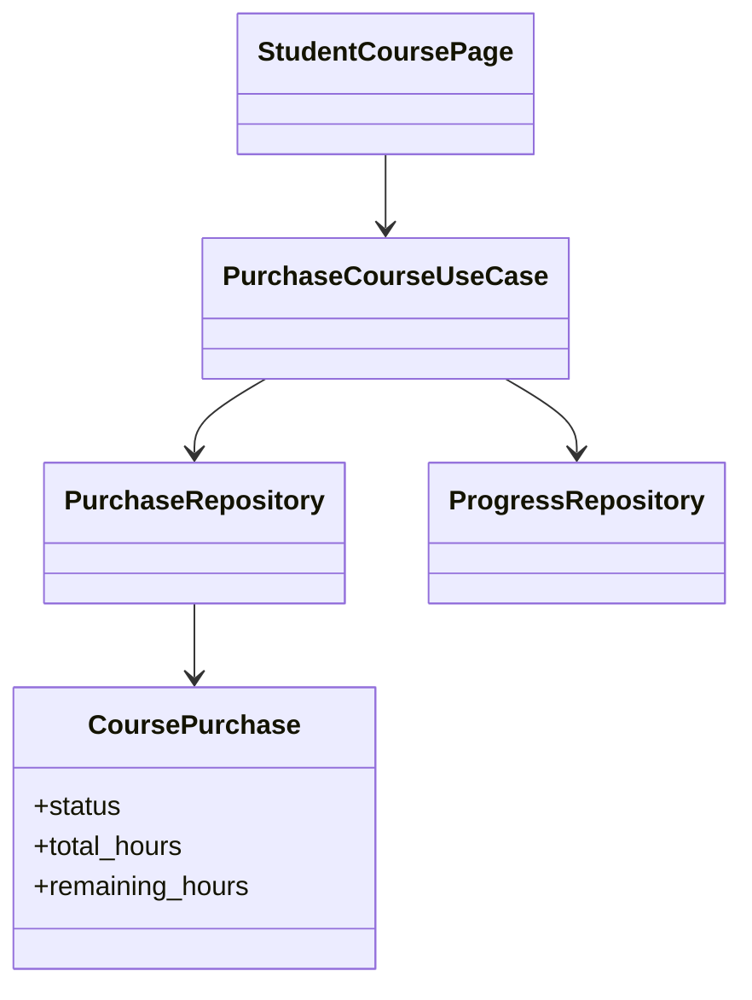
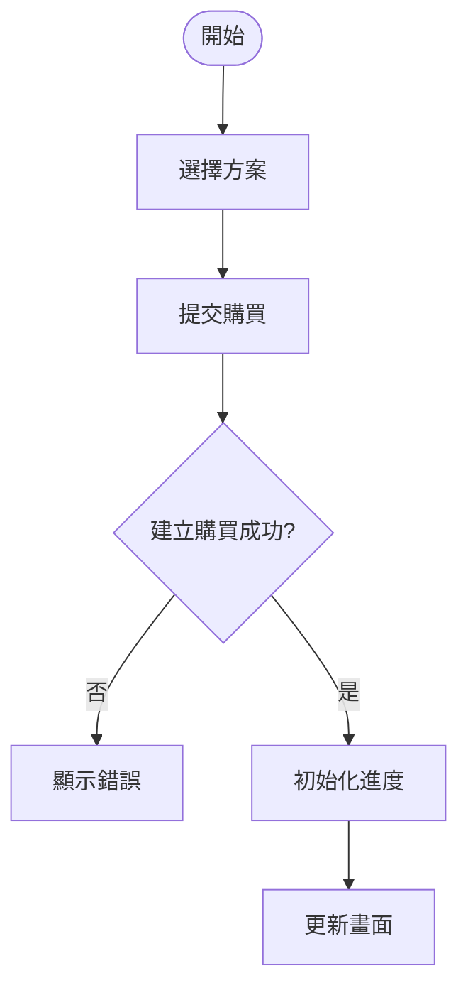
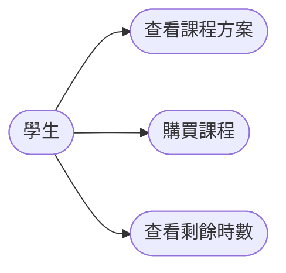

## 3. Student：購買課程方案

### Sequence Diagram

```mermaid
sequenceDiagram
    actor Student
    participant UI as StudentCoursePage
    participant Action as purchaseCourse
    participant PurchaseRepo
    participant ProgressRepo

    Student->>UI: 點擊購買
    UI->>Action: purchaseCourse(courseId,hours,price)
    Action->>PurchaseRepo: 建立購買紀錄
    Action->>ProgressRepo: 初始化課程進度(若不存在)
    Action-->>UI: success
    UI-->>Student: 顯示成功與剩餘時數
```

### Class Diagram

```mermaid
classDiagram
    class StudentCoursePage
    class PurchaseCourseUseCase
    class PurchaseRepository
    class ProgressRepository
    class CoursePurchase {
      +status
      +total_hours
      +remaining_hours
    }

    StudentCoursePage --> PurchaseCourseUseCase
    PurchaseCourseUseCase --> PurchaseRepository
    PurchaseCourseUseCase --> ProgressRepository
    PurchaseRepository --> CoursePurchase
```

### Activity Diagram

```mermaid
flowchart TD
    A([開始]) --> B[選擇方案]
    B --> C[提交購買]
    C --> D{建立購買成功?}
    D -- 否 --> E[顯示錯誤]
    D -- 是 --> F[初始化進度]
    F --> G[更新畫面]
```

### Use Case Diagram

```mermaid
flowchart LR
    Student([學生])
    Student --> UC1(["查看課程方案"])
    Student --> UC2(["購買課程"])
    Student --> UC3(["查看剩餘時數"])
```

