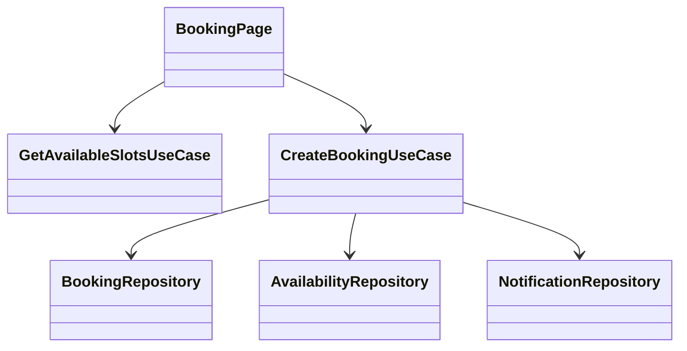
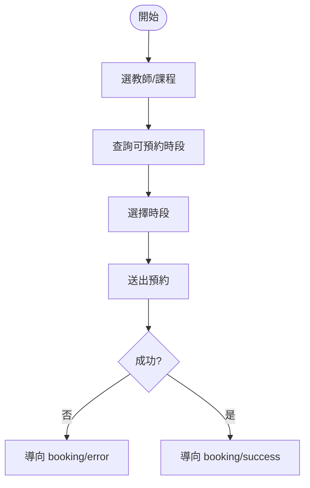
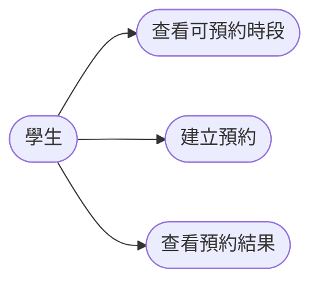

## 4. Student：預約課程

### Sequence Diagram
```mermaid
sequenceDiagram
    actor Student
    participant UI as BookingPage
    participant Slot as getAvailableSlots
    participant Create as createBooking
    participant Notify as NotificationRepo

    Student->>UI: 選擇日期/時段
    UI->>Slot: getAvailableSlots()
    Slot-->>UI: 可預約時段
    Student->>UI: 送出預約
    UI->>Create: createBooking(data)
    Create->>Notify: 建立通知
    Create-->>UI: booking result
    UI-->>Student: 成功或失敗頁
```

### Class Diagram


### Activity Diagram


### Use Case Diagram


