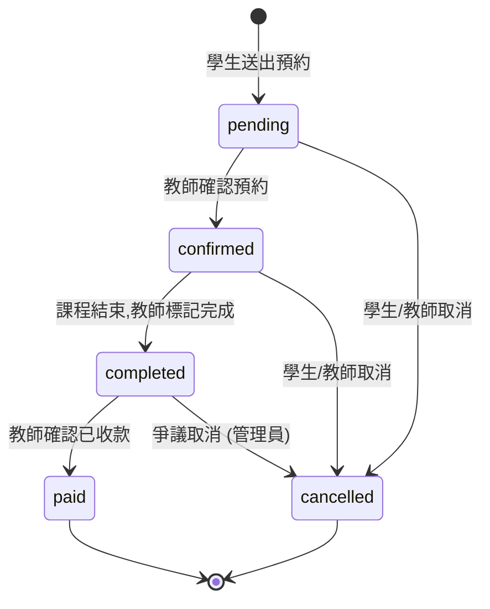
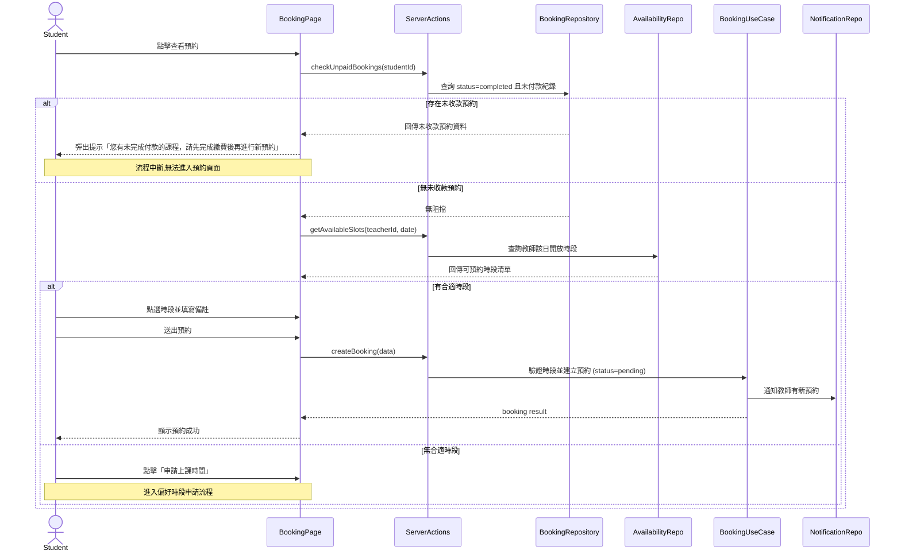
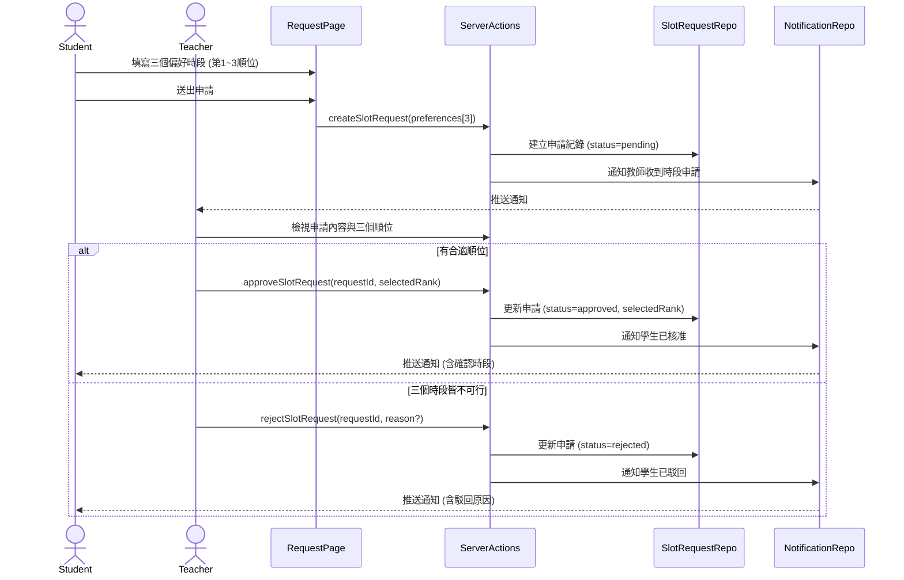
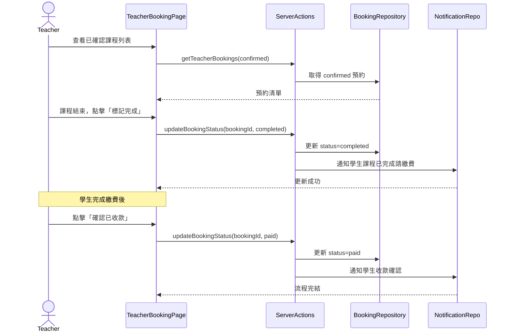
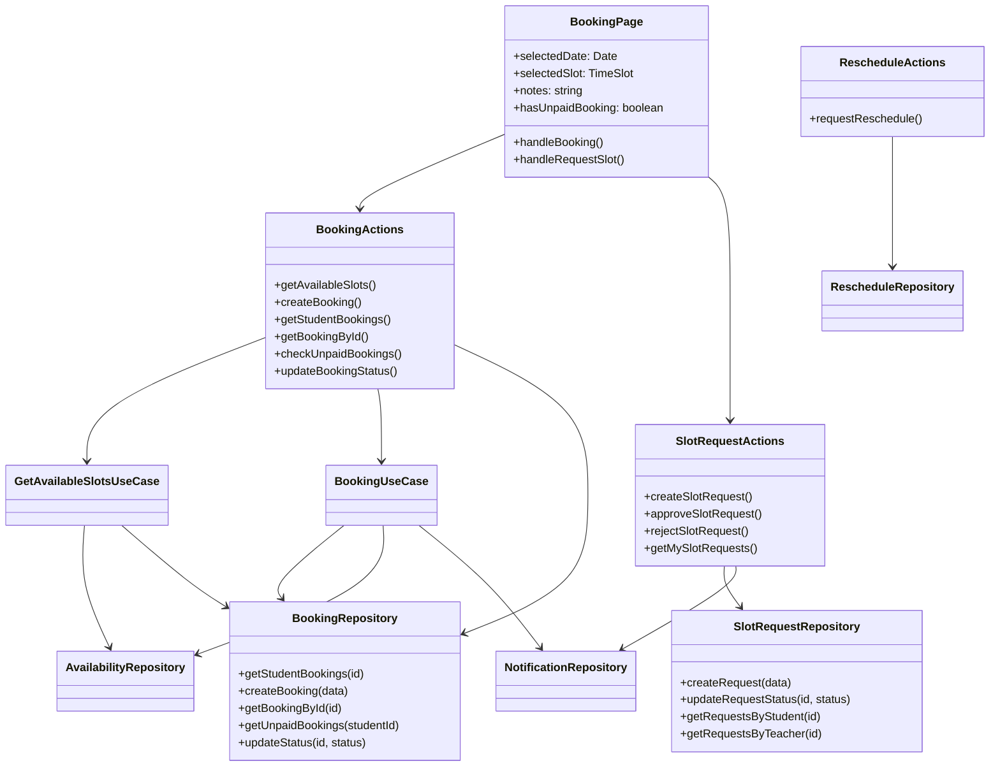
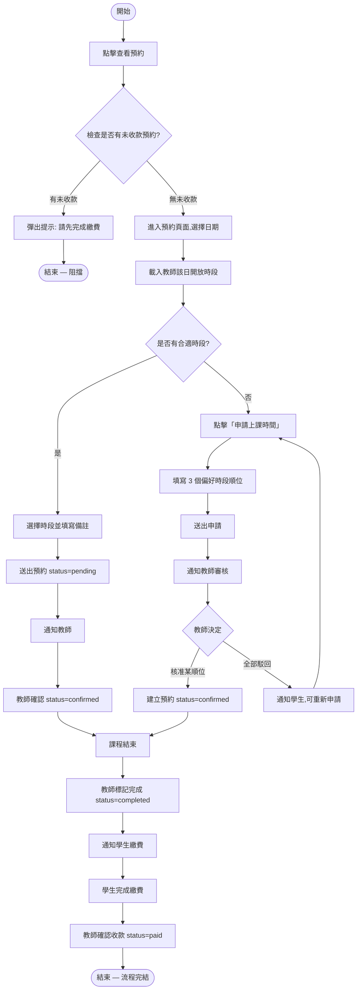
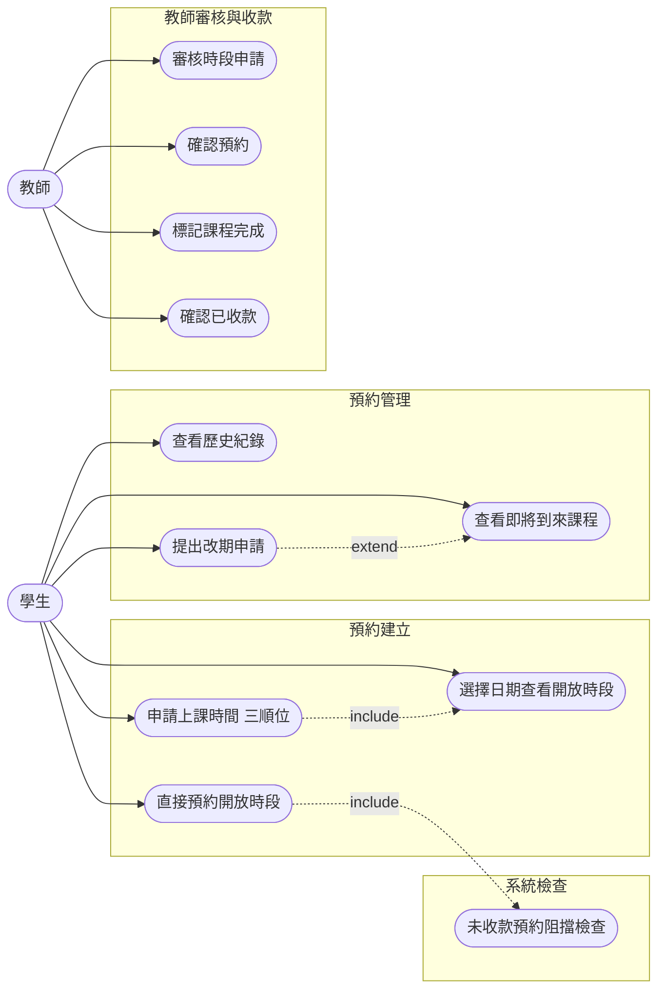

## 4. Student：預約課程

### 預約狀態生命週期 (Booking Status Lifecycle)

> **狀態說明**
>
> | 狀態 | 說明 | 可執行操作 |
> |---|---|---|
> | `pending` | 學生送出預約，等待教師確認 | 教師確認 / 取消 |
> | `confirmed` | 教師已確認，等待上課 | 改期 / 取消 / 教師標記完成 |
> | `completed` | 課程已結束，等待收款確認 | 教師標記已收款 |
> | `paid` | 教師已確認收款，流程完結 | — |
> | `cancelled` | 預約已取消 | — |

---

### Sequence Diagram — 直接預約 (含未收款阻擋)

### Sequence Diagram — 偏好時段申請 (三順位申請)

### Sequence Diagram — 課後確認與收款 (教師端)

### Class Diagram

### Activity Diagram

### Use Case Diagram

---

### 操作流程 (Operation Flow)

#### 1. 直接預約教師開放時段 (Direct Booking)

1. **點擊查看預約**：學生從儀表板或側邊導覽列點擊「查看預約」。
2. **未收款阻擋檢查**：系統呼叫 `checkUnpaidBookings(studentId)` 檢查是否有 `status=completed`（已完成但未收款）的預約。
   - **有未收款紀錄**：彈出提示訊息「您有未完成付款的課程，請先完成繳費後再進行新預約」，**阻擋進入預約頁面**。
   - **無未收款紀錄**：正常進入預約頁面。
3. **選擇日期**：在月曆上選擇一個日期，系統呼叫 `getAvailableSlots(teacherId, date)` 查詢教師當日的開放時段。
4. **瀏覽可用時段**：已被預約的時段會標示為不可選取 (greyed out)。
5. **選擇時段並送出**：學生點選時段、填寫備註，送出後系統建立 `status=pending` 的預約紀錄並通知教師。
6. **結果**：成功後導向預約列表 (`/student/bookings`)。

#### 2. 申請上課時間 — 三順位偏好 (Slot Request)

> 當教師開放的時段都不符合學生需求時，學生可以主動提出偏好時段申請。

1. **發起申請**：學生在預約頁面點擊「申請上課時間」按鈕。
2. **填寫三個順位**：依序填入三個偏好時段（含日期與時間），依優先順序排列。
3. **送出申請**：系統建立 `status=pending` 的時段申請紀錄，並通知教師。
4. **教師審核**：
   - **核准**：教師選擇其中一個順位，系統自動建立預約紀錄並通知學生。
   - **駁回**：教師駁回並附上原因，學生可重新發起申請。

#### 3. 課後確認與收款流程 (Post-Lesson Confirmation)

1. **教師標記完成**：課程結束後，教師在預約管理頁點擊「標記完成」，預約狀態變為 `completed`，系統通知學生進行繳費。
2. **學生繳費**：學生透過線下（轉帳、現金等）方式完成付款。
3. **教師確認收款**：教師收到款項後，在預約管理頁點擊「確認已收款」，狀態變為 `paid`，流程完結。
4. **未收款阻擋**：若學生有任何 `completed`（已完成但未收款）的預約，系統將阻擋其建立新預約，直到繳清為止。

#### 4. 查看已預約與提出改期 (View Bookings & Reschedule)

1. **進入預約列表**：學生從側邊導覽列進入「我的預約」(`/student/bookings`)。
2. **取得資料**：系統呼叫 `getStudentBookings()` 取得所有預約紀錄。
3. **頁籤切換**：
   - **即將到來 (Upcoming)**：顯示 `pending` / `confirmed` 狀態的預約。學生可發起改期申請 (`requestReschedule`)。
   - **歷史紀錄 (History)**：顯示 `completed` / `paid` / `cancelled` 狀態的紀錄，可回顧課程回饋。
   - **每張預約卡片**會根據狀態顯示不同標籤色：待確認 (amber)、已確認 (green)、已完成待收款 (blue)、已收款 (teal)、已取消 (grey)。
