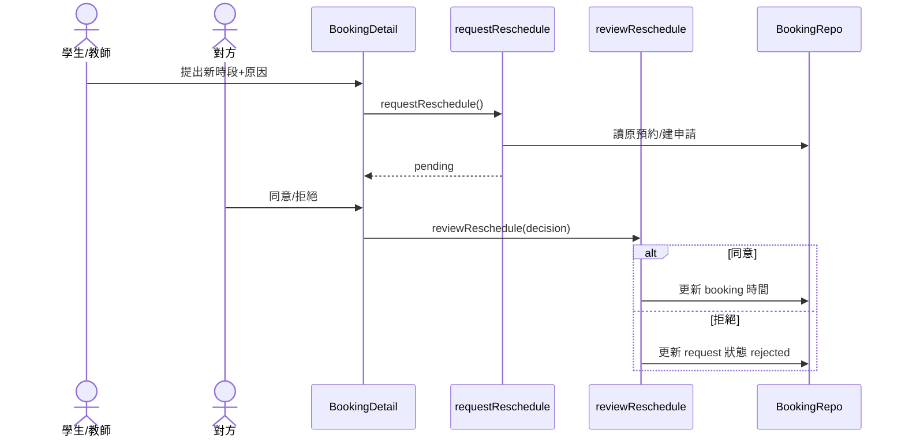
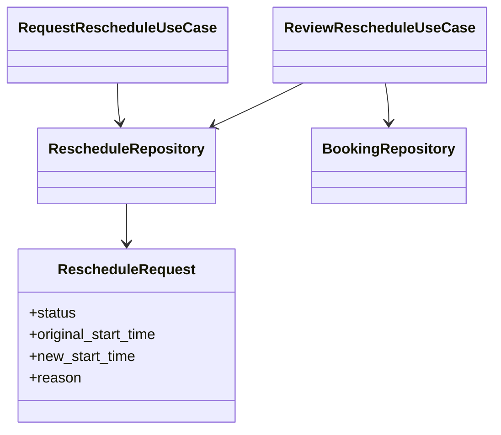
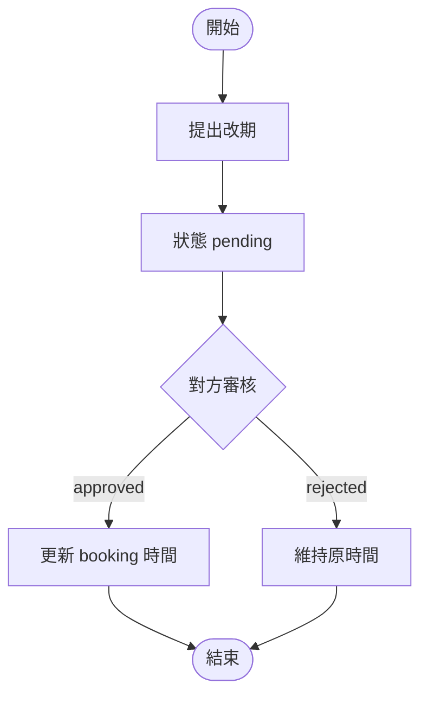
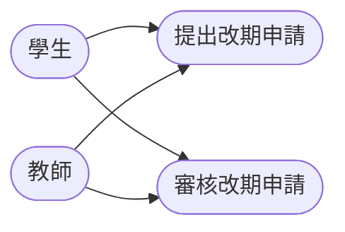

## 5. Booking：改期申請與審核

### Sequence Diagram

```mermaid
sequenceDiagram
    actor Requester as 學生/教師
    actor Reviewer as 對方
    participant UI as BookingDetail
    participant Req as requestReschedule
    participant Rev as reviewReschedule
    participant BRepo as BookingRepo

    Requester->>UI: 提出新時段+原因
    UI->>Req: requestReschedule()
    Req->>BRepo: 讀原預約/建申請
    Req-->>UI: pending
    Reviewer->>UI: 同意/拒絕
    UI->>Rev: reviewReschedule(decision)
    alt 同意
      Rev->>BRepo: 更新 booking 時間
    else 拒絕
      Rev->>BRepo: 更新 request 狀態 rejected
    end
```

### Class Diagram

```mermaid
classDiagram
    class RescheduleRequest {
      +status
      +original_start_time
      +new_start_time
      +reason
    }
    class RequestRescheduleUseCase
    class ReviewRescheduleUseCase
    class RescheduleRepository
    class BookingRepository

    RequestRescheduleUseCase --> RescheduleRepository
    ReviewRescheduleUseCase --> RescheduleRepository
    ReviewRescheduleUseCase --> BookingRepository
    RescheduleRepository --> RescheduleRequest
```

### Activity Diagram

```mermaid
flowchart TD
    A([開始]) --> B[提出改期]
    B --> C[狀態 pending]
    C --> D{對方審核}
    D -- approved --> E[更新 booking 時間]
    D -- rejected --> F[維持原時間]
    E --> G([結束])
    F --> G
```

### Use Case Diagram

```mermaid
flowchart LR
    Student([學生])
    Teacher([教師])

    Student --> UC1(["提出改期申請"])
    Teacher --> UC1(["提出改期申請"])
    Student --> UC2(["審核改期申請"])
    Teacher --> UC2(["審核改期申請"])
```

