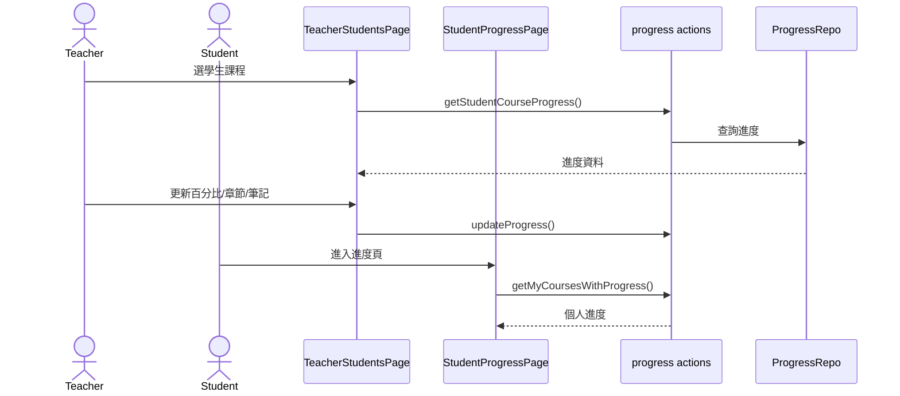
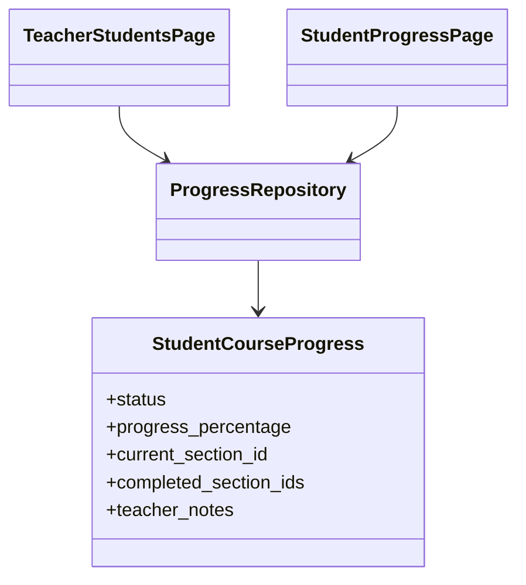
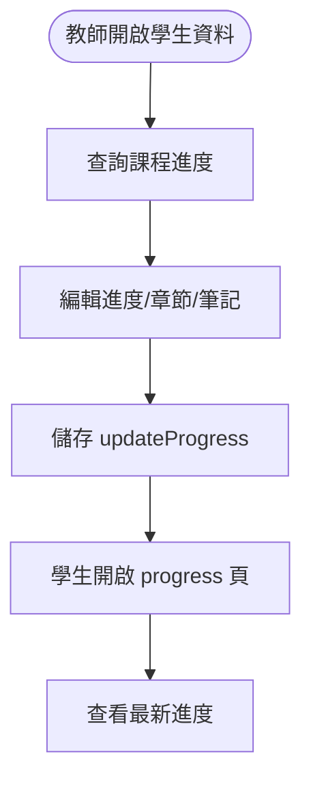
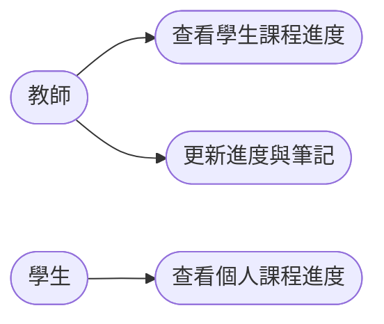

## 6. Progress：教師更新 / 學生查看學習進度

### Sequence Diagram

```mermaid
sequenceDiagram
    actor Teacher
    actor Student
    participant TUI as TeacherStudentsPage
    participant SUI as StudentProgressPage
    participant Action as progress actions
    participant Repo as ProgressRepo

    Teacher->>TUI: 選學生課程
    TUI->>Action: getStudentCourseProgress()
    Action->>Repo: 查詢進度
    Repo-->>TUI: 進度資料
    Teacher->>TUI: 更新百分比/章節/筆記
    TUI->>Action: updateProgress()
    Student->>SUI: 進入進度頁
    SUI->>Action: getMyCoursesWithProgress()
    Action-->>SUI: 個人進度
```

### Class Diagram

```mermaid
classDiagram
    class StudentCourseProgress {
      +status
      +progress_percentage
      +current_section_id
      +completed_section_ids
      +teacher_notes
    }
    class ProgressRepository
    class TeacherStudentsPage
    class StudentProgressPage

    TeacherStudentsPage --> ProgressRepository
    StudentProgressPage --> ProgressRepository
    ProgressRepository --> StudentCourseProgress
```

### Activity Diagram

```mermaid
flowchart TD
    A([教師開啟學生資料]) --> B[查詢課程進度]
    B --> C[編輯進度/章節/筆記]
    C --> D[儲存 updateProgress]
    D --> E[學生開啟 progress 頁]
    E --> F[查看最新進度]
```

### Use Case Diagram

```mermaid
flowchart LR
    Teacher([教師])
    Student([學生])

    Teacher --> UC1(["查看學生課程進度"])
    Teacher --> UC2(["更新進度與筆記"])
    Student --> UC3(["查看個人課程進度"])
```

