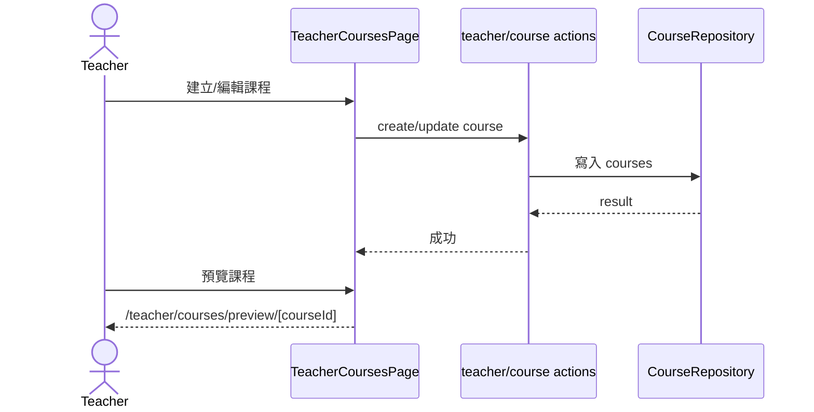
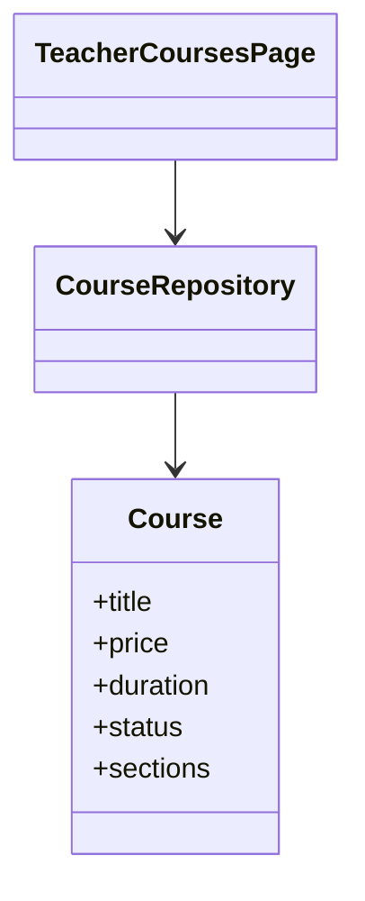
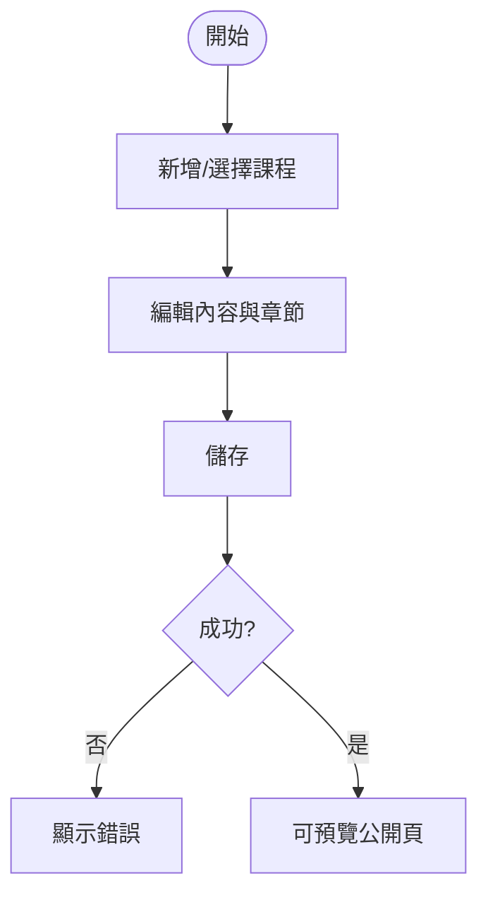
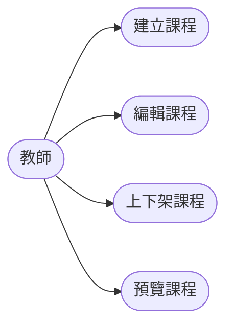

## 7. Teacher：課程管理

### Sequence Diagram

```mermaid
sequenceDiagram
    actor Teacher
    participant UI as TeacherCoursesPage
    participant Action as teacher/course actions
    participant Repo as CourseRepository

    Teacher->>UI: 建立/編輯課程
    UI->>Action: create/update course
    Action->>Repo: 寫入 courses
    Repo-->>Action: result
    Action-->>UI: 成功
    Teacher->>UI: 預覽課程
    UI-->>Teacher: /teacher/courses/preview/[courseId]
```

### Class Diagram

```mermaid
classDiagram
    class Course {
      +title
      +price
      +duration
      +status
      +sections
    }
    class TeacherCoursesPage
    class CourseRepository

    TeacherCoursesPage --> CourseRepository
    CourseRepository --> Course
```

### Activity Diagram

```mermaid
flowchart TD
    A([開始]) --> B[新增/選擇課程]
    B --> C[編輯內容與章節]
    C --> D[儲存]
    D --> E{成功?}
    E -- 否 --> F[顯示錯誤]
    E -- 是 --> G[可預覽公開頁]
```

### Use Case Diagram

```mermaid
flowchart LR
    Teacher([教師])
    Teacher --> UC1(["建立課程"])
    Teacher --> UC2(["編輯課程"])
    Teacher --> UC3(["上下架課程"])
    Teacher --> UC4(["預覽課程"])
```

