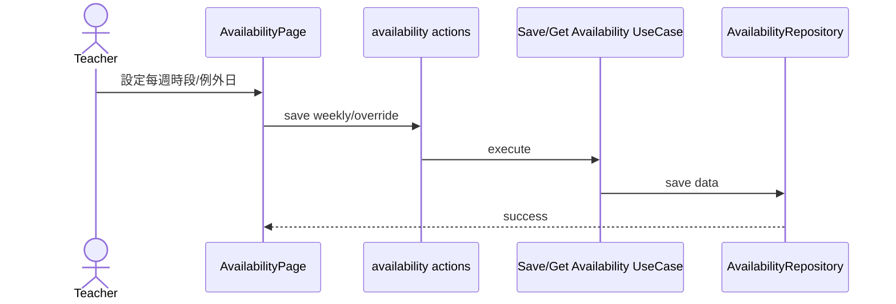
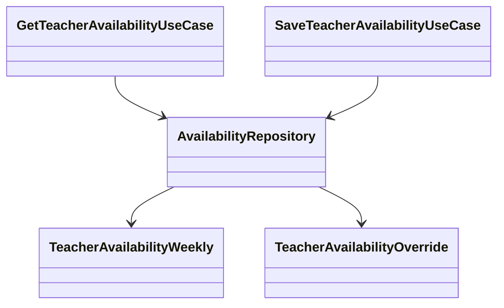
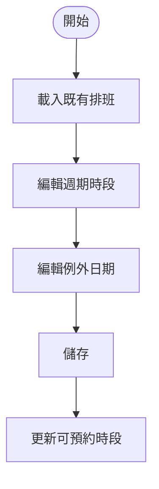
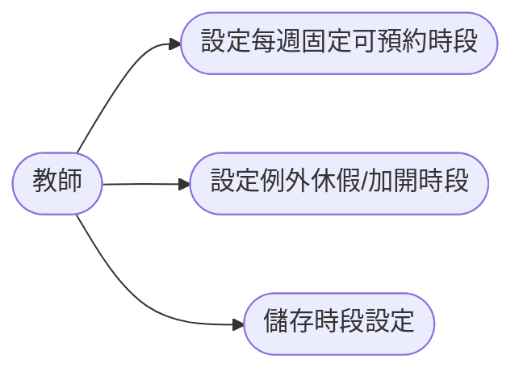

## 8. Teacher：可預約時段管理

### Sequence Diagram

```mermaid
sequenceDiagram
    actor Teacher
    participant UI as AvailabilityPage
    participant Action as availability actions
    participant UCase as Save/Get Availability UseCase
    participant Repo as AvailabilityRepository

    Teacher->>UI: 設定每週時段/例外日
    UI->>Action: save weekly/override
    Action->>UCase: execute
    UCase->>Repo: save data
    Repo-->>UI: success
```

### Class Diagram

```mermaid
classDiagram
    class TeacherAvailabilityWeekly
    class TeacherAvailabilityOverride
    class GetTeacherAvailabilityUseCase
    class SaveTeacherAvailabilityUseCase
    class AvailabilityRepository

    GetTeacherAvailabilityUseCase --> AvailabilityRepository
    SaveTeacherAvailabilityUseCase --> AvailabilityRepository
    AvailabilityRepository --> TeacherAvailabilityWeekly
    AvailabilityRepository --> TeacherAvailabilityOverride
```

### Activity Diagram

```mermaid
flowchart TD
    A([開始]) --> B[載入既有排班]
    B --> C[編輯週期時段]
    C --> D[編輯例外日期]
    D --> E[儲存]
    E --> F[更新可預約時段]
```

### Use Case Diagram

```mermaid
flowchart LR
    Teacher([教師])
    Teacher --> UC1(["設定每週固定可預約時段"])
    Teacher --> UC2(["設定例外休假/加開時段"])
    Teacher --> UC3(["儲存時段設定"])
```

