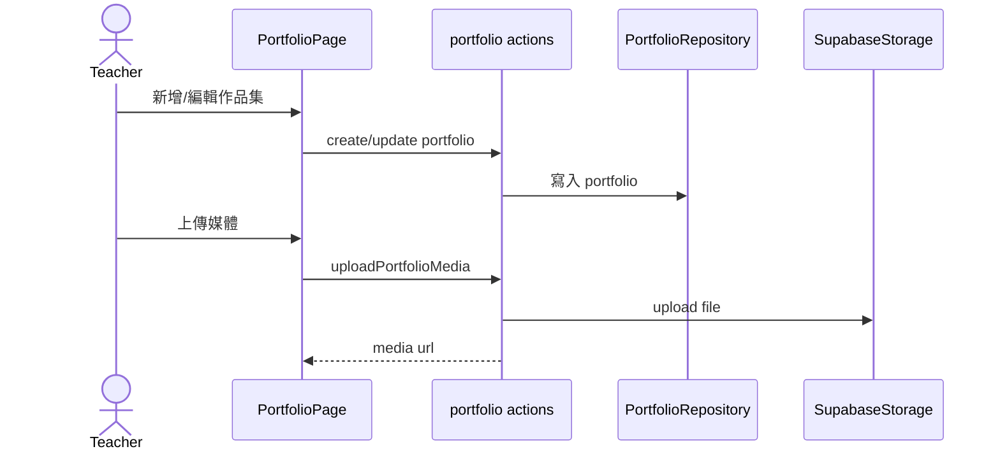
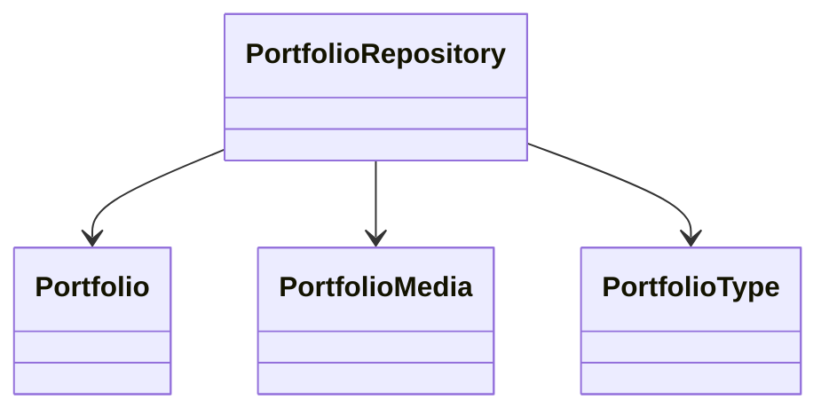
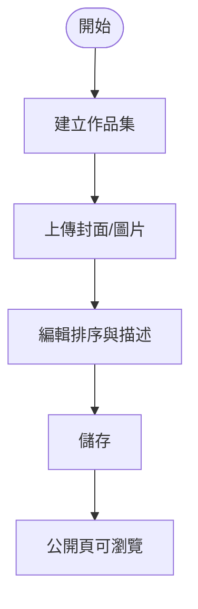
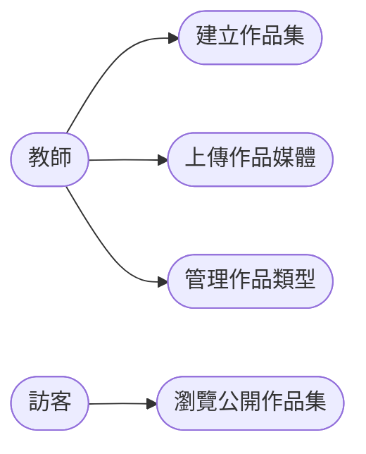

## 9. Teacher：作品集管理

### Sequence Diagram

```mermaid
sequenceDiagram
    actor Teacher
    participant UI as PortfolioPage
    participant Action as portfolio actions
    participant Repo as PortfolioRepository
    participant Storage as SupabaseStorage

    Teacher->>UI: 新增/編輯作品集
    UI->>Action: create/update portfolio
    Action->>Repo: 寫入 portfolio
    Teacher->>UI: 上傳媒體
    UI->>Action: uploadPortfolioMedia
    Action->>Storage: upload file
    Action-->>UI: media url
```

### Class Diagram

```mermaid
classDiagram
    class Portfolio
    class PortfolioMedia
    class PortfolioType
    class PortfolioRepository

    PortfolioRepository --> Portfolio
    PortfolioRepository --> PortfolioMedia
    PortfolioRepository --> PortfolioType
```

### Activity Diagram

```mermaid
flowchart TD
    A([開始]) --> B[建立作品集]
    B --> C[上傳封面/圖片]
    C --> D[編輯排序與描述]
    D --> E[儲存]
    E --> F[公開頁可瀏覽]
```

### Use Case Diagram

```mermaid
flowchart LR
    Teacher([教師])
    Visitor([訪客])

    Teacher --> UC1(["建立作品集"])
    Teacher --> UC2(["上傳作品媒體"])
    Teacher --> UC3(["管理作品類型"])
    Visitor --> UC4(["瀏覽公開作品集"])
```

