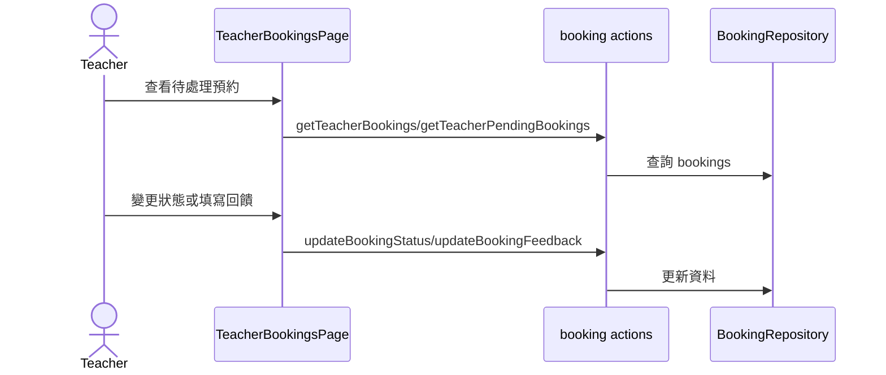
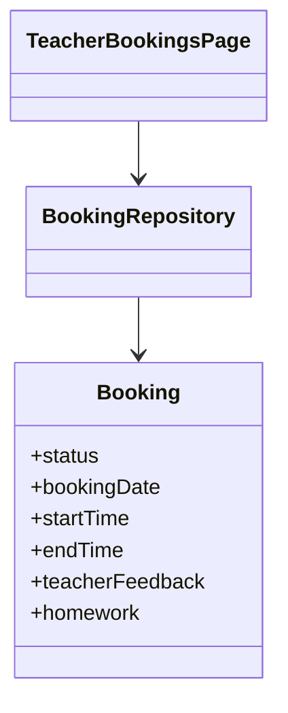
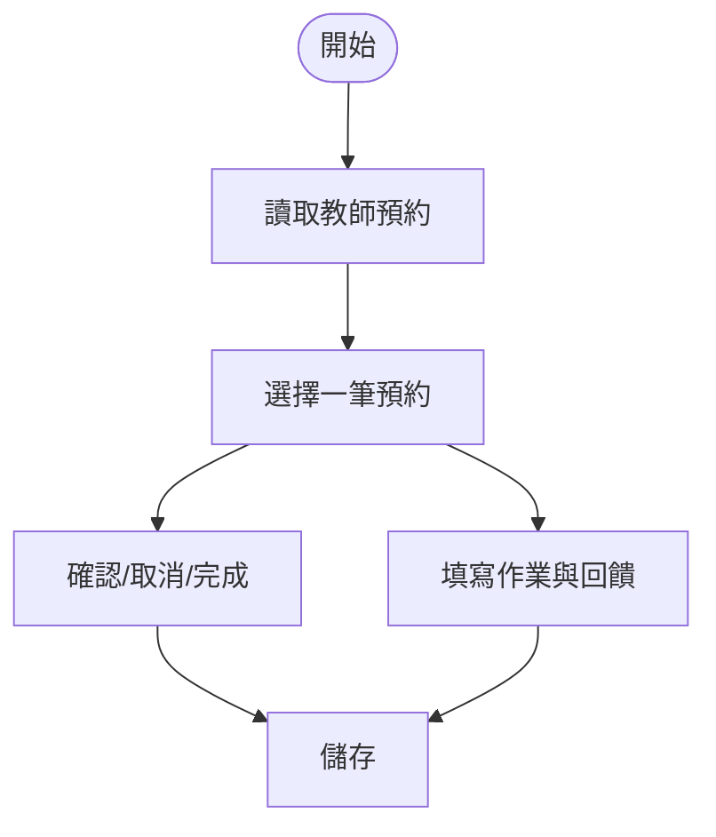
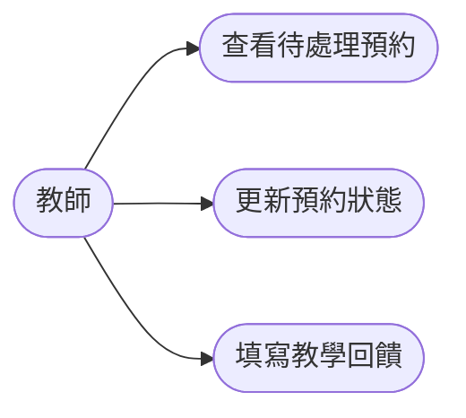

## 10. Teacher：預約管理（確認/取消/完成/回饋）

### Sequence Diagram

```mermaid
sequenceDiagram
    actor Teacher
    participant UI as TeacherBookingsPage
    participant Action as booking actions
    participant Repo as BookingRepository

    Teacher->>UI: 查看待處理預約
    UI->>Action: getTeacherBookings/getTeacherPendingBookings
    Action->>Repo: 查詢 bookings
    Teacher->>UI: 變更狀態或填寫回饋
    UI->>Action: updateBookingStatus/updateBookingFeedback
    Action->>Repo: 更新資料
```

### Class Diagram

```mermaid
classDiagram
    class Booking {
      +status
      +bookingDate
      +startTime
      +endTime
      +teacherFeedback
      +homework
    }
    class TeacherBookingsPage
    class BookingRepository

    TeacherBookingsPage --> BookingRepository
    BookingRepository --> Booking
```

### Activity Diagram

```mermaid
flowchart TD
    A([開始]) --> B[讀取教師預約]
    B --> C[選擇一筆預約]
    C --> D[確認/取消/完成]
    C --> E[填寫作業與回饋]
    D --> F[儲存]
    E --> F
```

### Use Case Diagram

```mermaid
flowchart LR
    Teacher([教師])
    Teacher --> UC1(["查看待處理預約"])
    Teacher --> UC2(["更新預約狀態"])
    Teacher --> UC3(["填寫教學回饋"])
```

