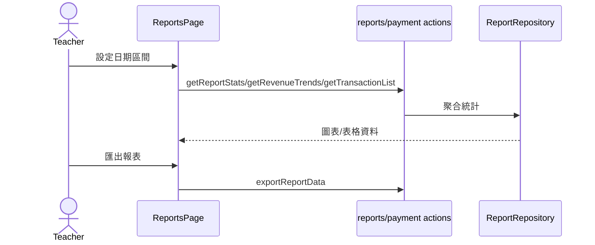
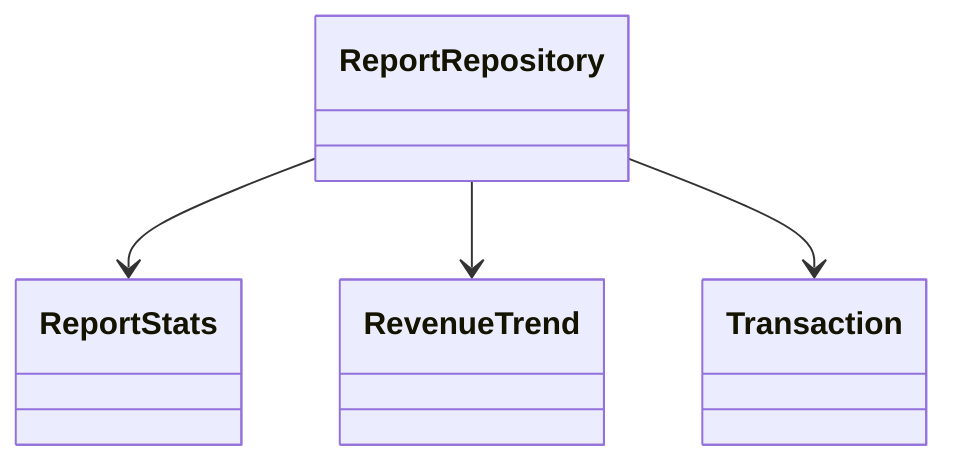
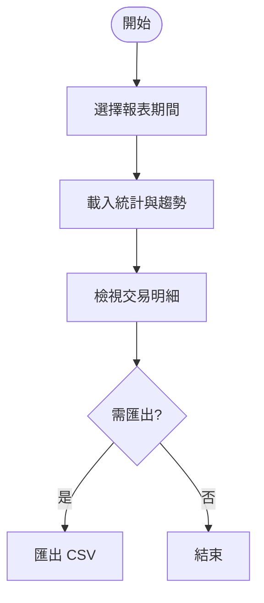
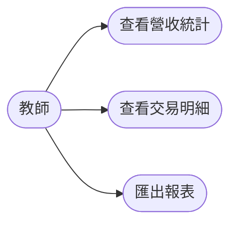

## 11. Teacher：營收報表與收款

### Sequence Diagram

```mermaid
sequenceDiagram
    actor Teacher
    participant UI as ReportsPage
    participant Action as reports/payment actions
    participant Repo as ReportRepository

    Teacher->>UI: 設定日期區間
    UI->>Action: getReportStats/getRevenueTrends/getTransactionList
    Action->>Repo: 聚合統計
    Repo-->>UI: 圖表/表格資料
    Teacher->>UI: 匯出報表
    UI->>Action: exportReportData
```

### Class Diagram

```mermaid
classDiagram
    class ReportStats
    class RevenueTrend
    class Transaction
    class ReportRepository

    ReportRepository --> ReportStats
    ReportRepository --> RevenueTrend
    ReportRepository --> Transaction
```

### Activity Diagram

```mermaid
flowchart TD
    A([開始]) --> B[選擇報表期間]
    B --> C[載入統計與趨勢]
    C --> D[檢視交易明細]
    D --> E{需匯出?}
    E -- 是 --> F[匯出 CSV]
    E -- 否 --> G[結束]
```

### Use Case Diagram

```mermaid
flowchart LR
    Teacher([教師])
    Teacher --> UC1(["查看營收統計"])
    Teacher --> UC2(["查看交易明細"])
    Teacher --> UC3(["匯出報表"])
```

