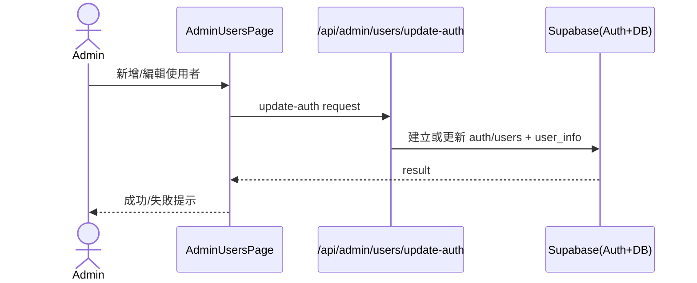
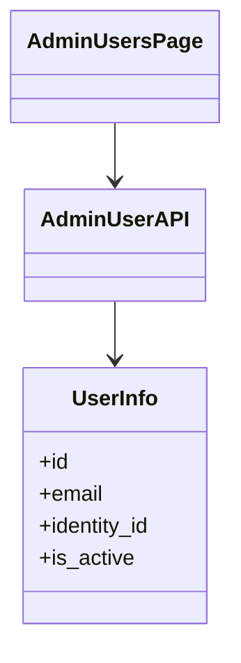
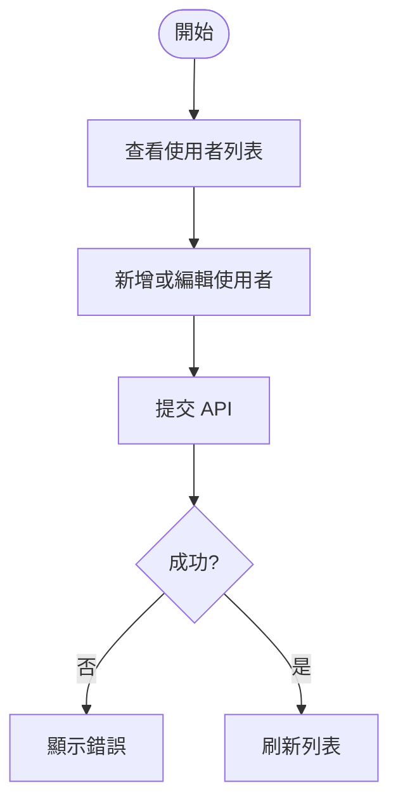
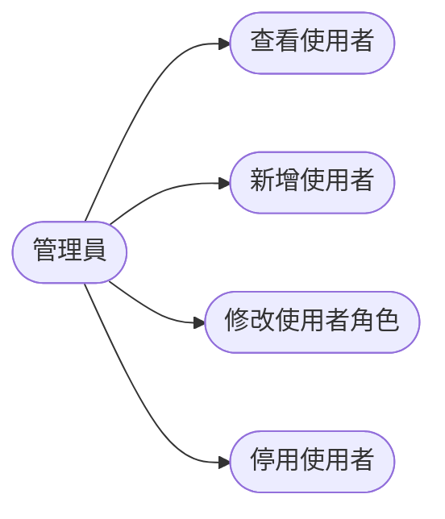

## 12. Admin：使用者管理

### Sequence Diagram

```mermaid
sequenceDiagram
    actor Admin
    participant UI as AdminUsersPage
    participant API as /api/admin/users/update-auth
    participant DB as Supabase(Auth+DB)

    Admin->>UI: 新增/編輯使用者
    UI->>API: update-auth request
    API->>DB: 建立或更新 auth/users + user_info
    DB-->>UI: result
    UI-->>Admin: 成功/失敗提示
```

### Class Diagram

```mermaid
classDiagram
    class AdminUsersPage
    class AdminUserAPI
    class UserInfo {
      +id
      +email
      +identity_id
      +is_active
    }

    AdminUsersPage --> AdminUserAPI
    AdminUserAPI --> UserInfo
```

### Activity Diagram

```mermaid
flowchart TD
    A([開始]) --> B[查看使用者列表]
    B --> C[新增或編輯使用者]
    C --> D[提交 API]
    D --> E{成功?}
    E -- 否 --> F[顯示錯誤]
    E -- 是 --> G[刷新列表]
```

### Use Case Diagram

```mermaid
flowchart LR
    Admin([管理員])
    Admin --> UC1(["查看使用者"])
    Admin --> UC2(["新增使用者"])
    Admin --> UC3(["修改使用者角色"])
    Admin --> UC4(["停用使用者"])
```

