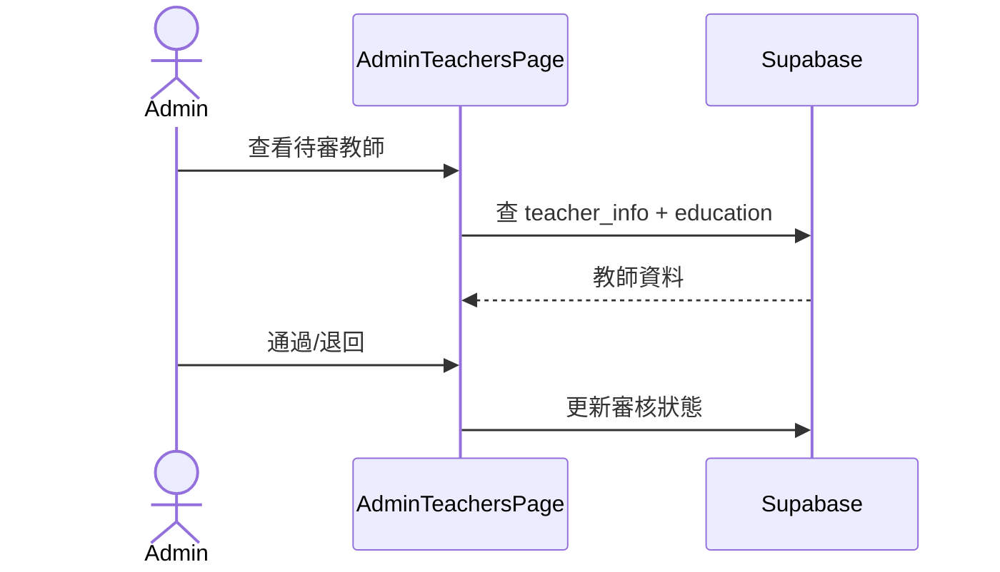
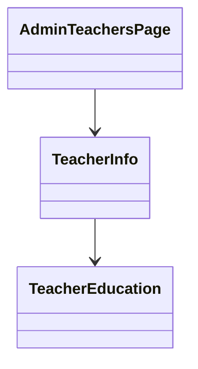
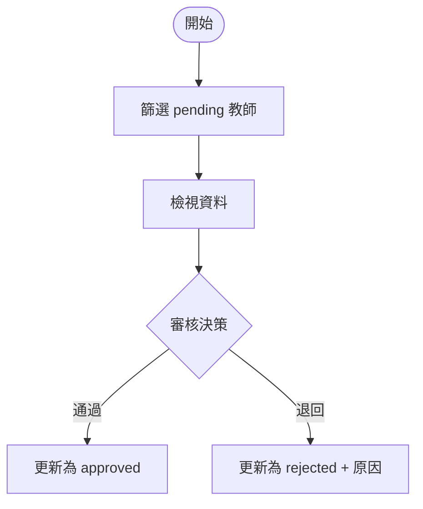
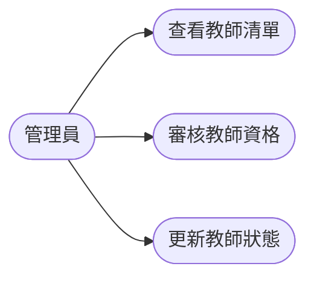

## 13. Admin：教師審核與管理

### Sequence Diagram

```mermaid
sequenceDiagram
    actor Admin
    participant UI as AdminTeachersPage
    participant DB as Supabase

    Admin->>UI: 查看待審教師
    UI->>DB: 查 teacher_info + education
    DB-->>UI: 教師資料
    Admin->>UI: 通過/退回
    UI->>DB: 更新審核狀態
```

### Class Diagram

```mermaid
classDiagram
    class TeacherInfo
    class TeacherEducation
    class AdminTeachersPage

    AdminTeachersPage --> TeacherInfo
    TeacherInfo --> TeacherEducation
```

### Activity Diagram

```mermaid
flowchart TD
    A([開始]) --> B[篩選 pending 教師]
    B --> C[檢視資料]
    C --> D{審核決策}
    D -- 通過 --> E[更新為 approved]
    D -- 退回 --> F[更新為 rejected + 原因]
```

### Use Case Diagram

```mermaid
flowchart LR
    Admin([管理員])
    Admin --> UC1(["查看教師清單"])
    Admin --> UC2(["審核教師資格"])
    Admin --> UC3(["更新教師狀態"])
```

