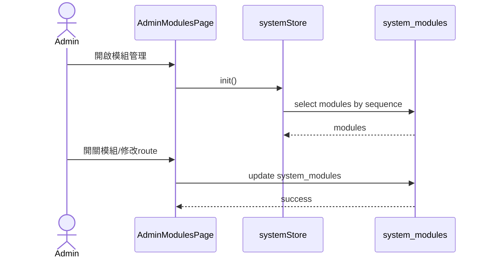
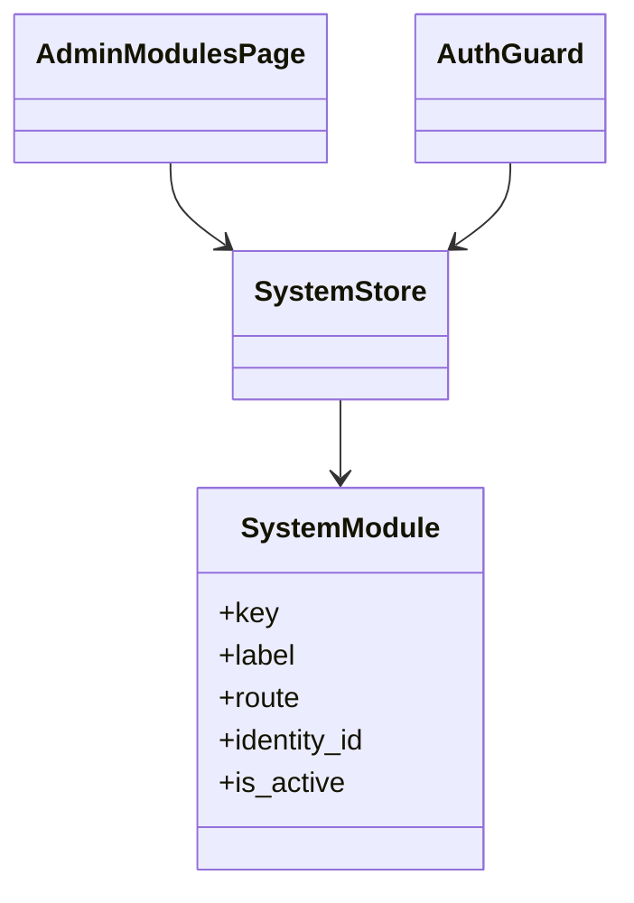
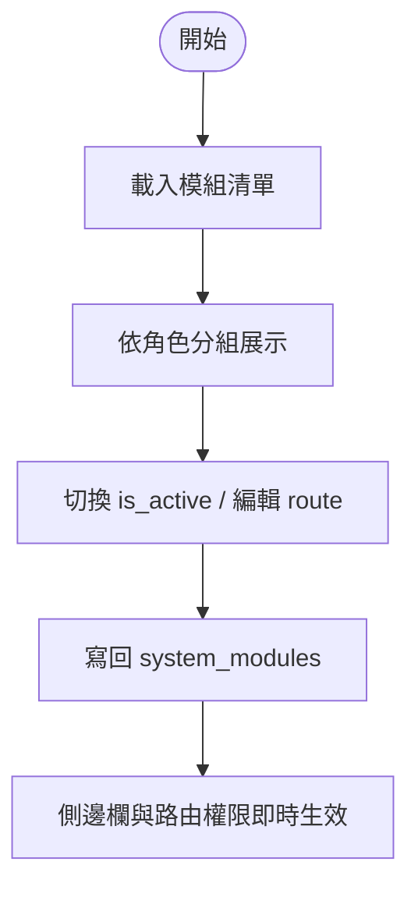
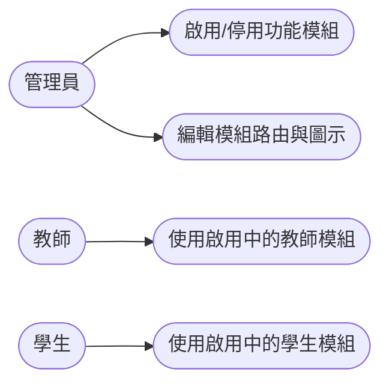

## 14. Admin：系統模組管理（權限開關）

### Sequence Diagram

```mermaid
sequenceDiagram
    actor Admin
    participant UI as AdminModulesPage
    participant Store as systemStore
    participant DB as system_modules

    Admin->>UI: 開啟模組管理
    UI->>Store: init()
    Store->>DB: select modules by sequence
    DB-->>Store: modules
    Admin->>UI: 開關模組/修改route
    UI->>DB: update system_modules
    DB-->>UI: success
```

### Class Diagram

```mermaid
classDiagram
    class SystemModule {
      +key
      +label
      +route
      +identity_id
      +is_active
    }
    class SystemStore
    class AdminModulesPage
    class AuthGuard

    AdminModulesPage --> SystemStore
    SystemStore --> SystemModule
    AuthGuard --> SystemStore
```

### Activity Diagram

```mermaid
flowchart TD
    A([開始]) --> B[載入模組清單]
    B --> C[依角色分組展示]
    C --> D[切換 is_active / 編輯 route]
    D --> E[寫回 system_modules]
    E --> F[側邊欄與路由權限即時生效]
```

### Use Case Diagram

```mermaid
flowchart LR
    Admin([管理員])
    Teacher([教師])
    Student([學生])

    Admin --> UC1(["啟用/停用功能模組"])
    Admin --> UC2(["編輯模組路由與圖示"])
    Teacher --> UC3(["使用啟用中的教師模組"])
    Student --> UC4(["使用啟用中的學生模組"])
```
