# TimeCarve 功能圖譜（每功能 4 種圖）

> 每個功能皆包含：Sequence Diagram / Class Diagram / Activity Diagram / Use Case Diagram

## 1. Auth：登入 / 註冊 / 首登導流

### Sequence Diagram
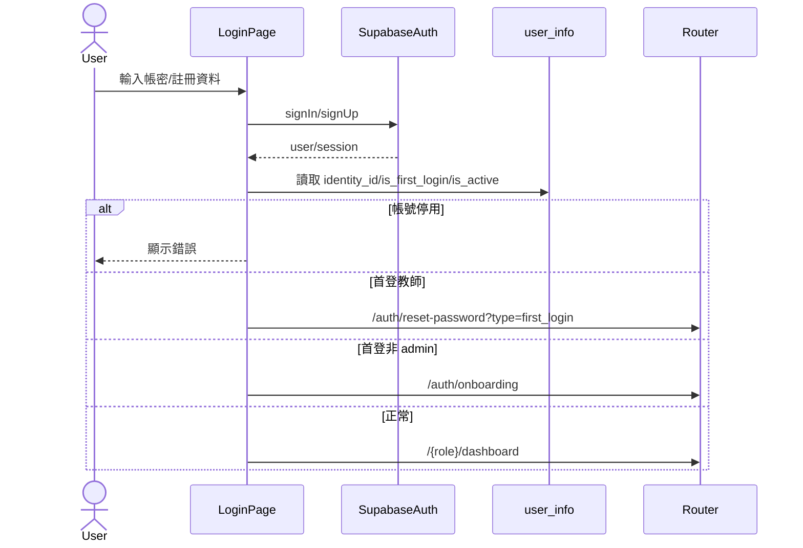

### Class Diagram
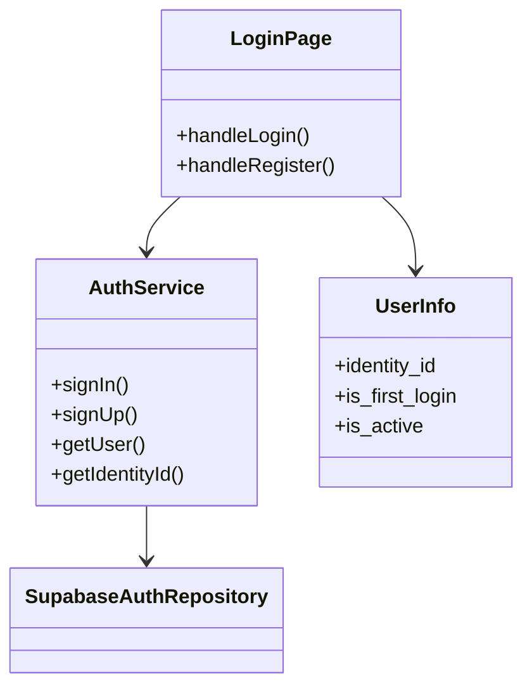

### Activity Diagram
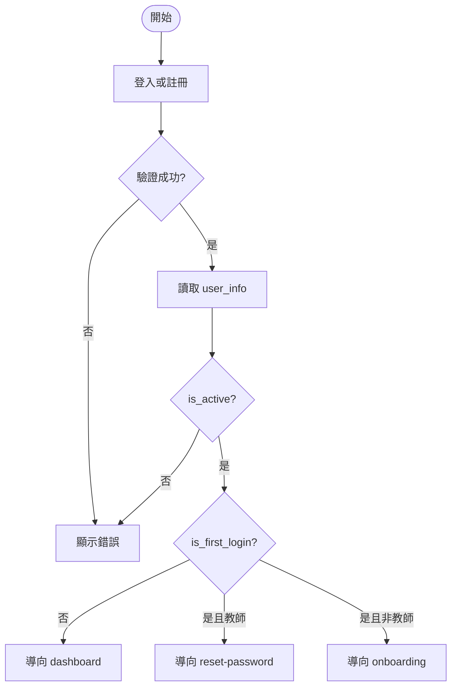

### Use Case Diagram
```mermaid
usecaseDiagram
    actor 訪客 as Guest
    actor 學生 as Student
    actor 教師 as Teacher

    Guest --> (註冊)
    Guest --> (登入)
    Student --> (完善個人資料)
    Teacher --> (首登重設密碼)
    Student --> (進入學生儀表板)
    Teacher --> (進入教師儀表板)
```

## 2. Public：瀏覽教師/課程/作品集

### Sequence Diagram
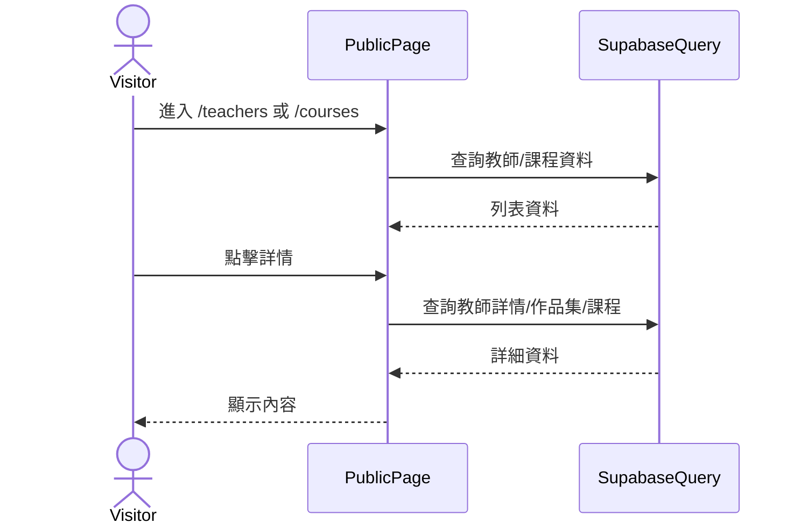

### Class Diagram
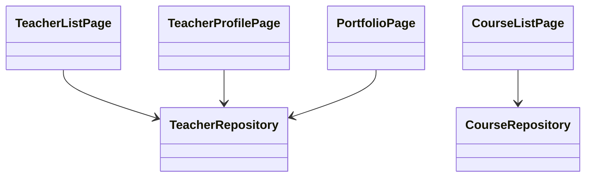

### Activity Diagram
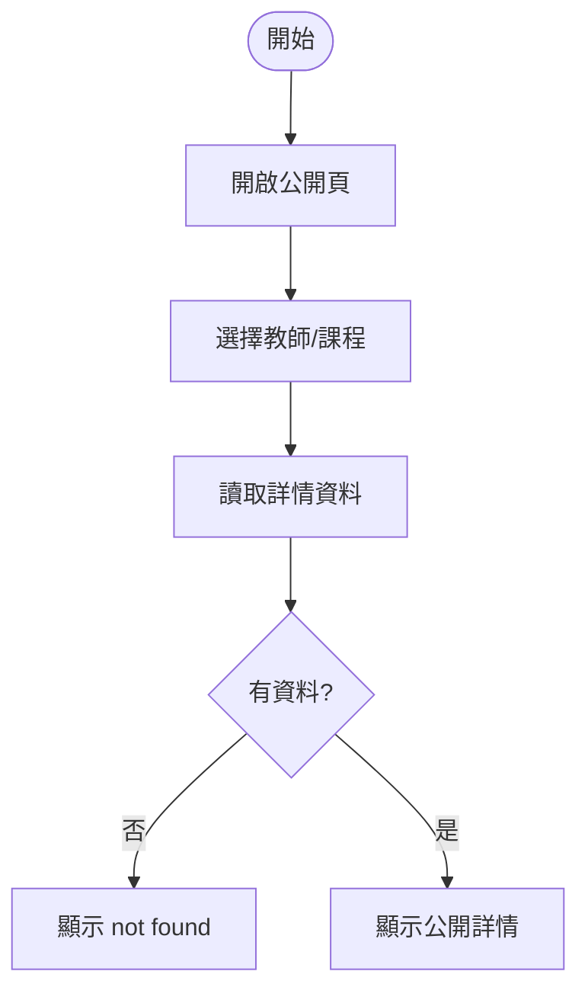

### Use Case Diagram
```mermaid
usecaseDiagram
    actor 訪客 as Visitor
    Visitor --> (瀏覽教師列表)
    Visitor --> (瀏覽課程列表)
    Visitor --> (查看教師詳情)
    Visitor --> (查看作品集)
```

## 3. Student：購買課程方案

### Sequence Diagram
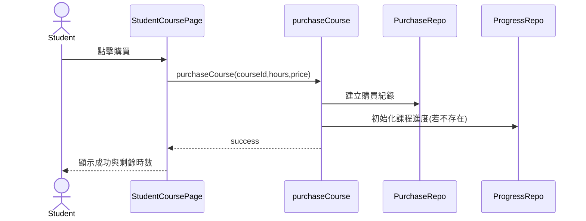

### Class Diagram
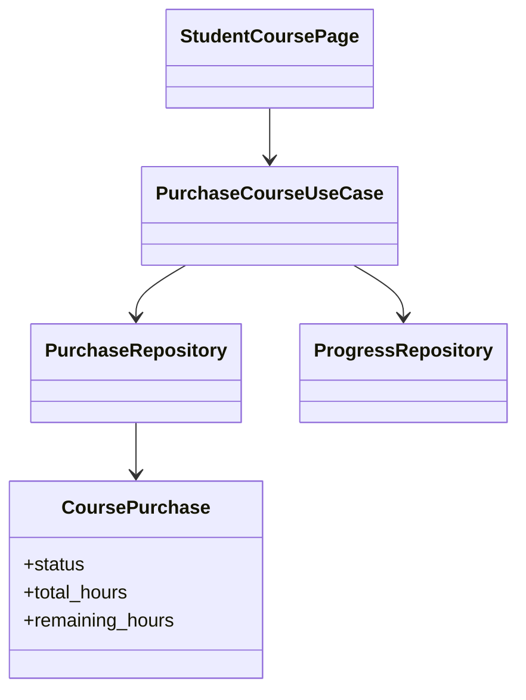

### Activity Diagram
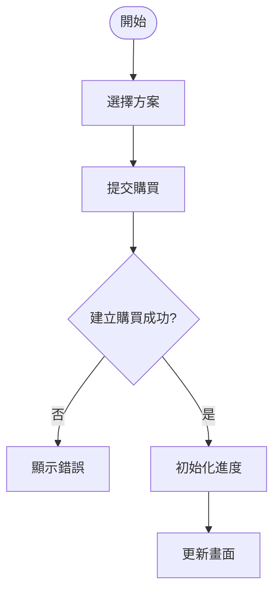

### Use Case Diagram
```mermaid
usecaseDiagram
    actor 學生 as Student
    Student --> (查看課程方案)
    Student --> (購買課程)
    Student --> (查看剩餘時數)
```

## 4. Student：預約課程

### Sequence Diagram
```mermaid
sequenceDiagram
    actor Student
    participant UI as BookingPage
    participant Slot as getAvailableSlots
    participant Create as createBooking
    participant Notify as NotificationRepo

    Student->>UI: 選擇日期/時段
    UI->>Slot: getAvailableSlots()
    Slot-->>UI: 可預約時段
    Student->>UI: 送出預約
    UI->>Create: createBooking(data)
    Create->>Notify: 建立通知
    Create-->>UI: booking result
    UI-->>Student: 成功或失敗頁
```

### Class Diagram
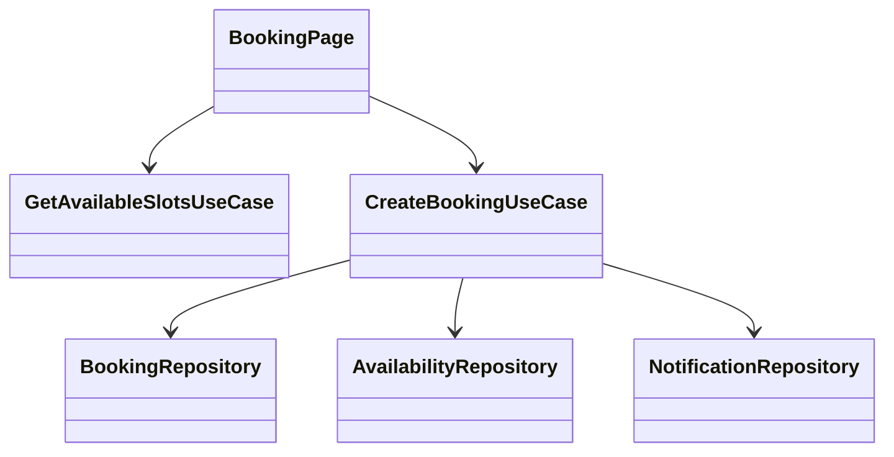

### Activity Diagram
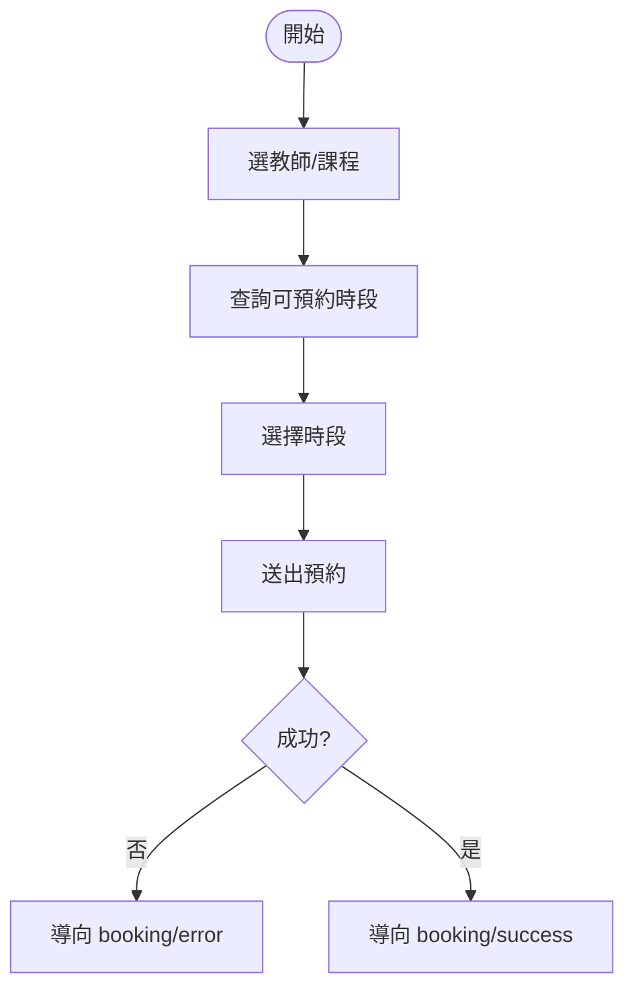

### Use Case Diagram
```mermaid
usecaseDiagram
    actor 學生 as Student
    Student --> (查看可預約時段)
    Student --> (建立預約)
    Student --> (查看預約結果)
```

## 5. Booking：改期申請與審核

### Sequence Diagram
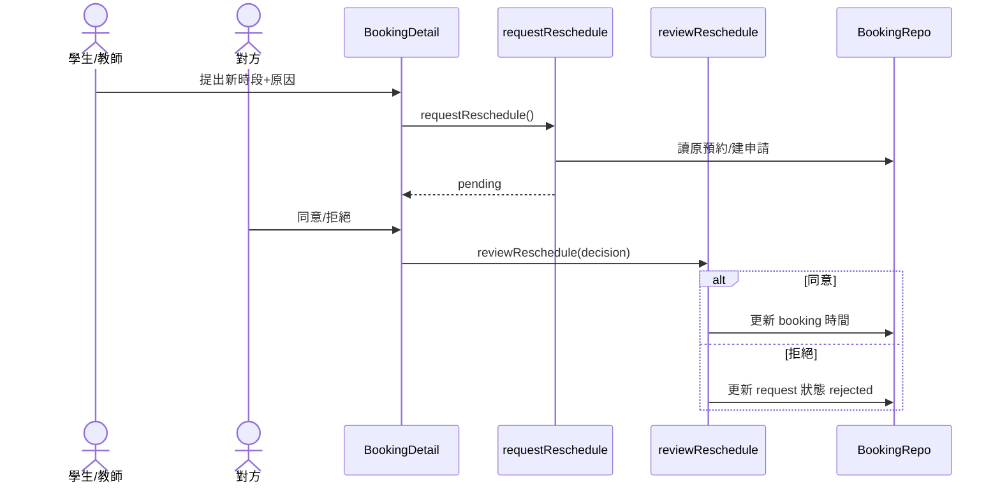

### Class Diagram
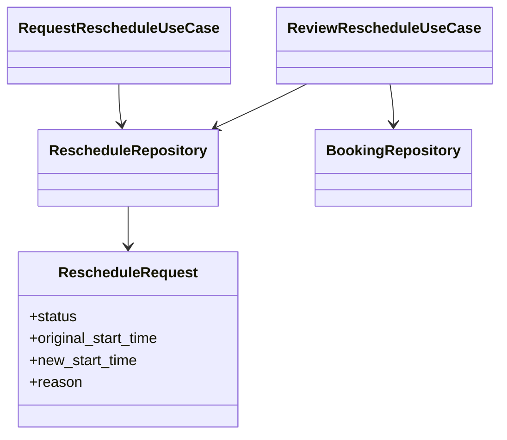

### Activity Diagram
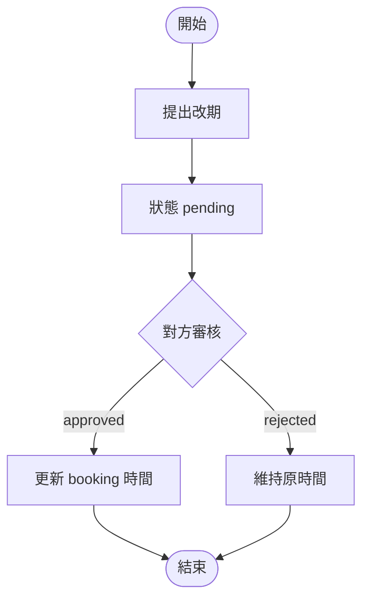

### Use Case Diagram
```mermaid
usecaseDiagram
    actor 學生 as Student
    actor 教師 as Teacher

    Student --> (提出改期申請)
    Teacher --> (提出改期申請)
    Student --> (審核改期申請)
    Teacher --> (審核改期申請)
```

## 6. Progress：教師更新 / 學生查看學習進度

### Sequence Diagram
```mermaid
sequenceDiagram
    actor Teacher
    actor Student
    participant TUI as TeacherStudentsPage
    participant SUI as StudentProgressPage
    participant Action as progress actions
    participant Repo as ProgressRepo

    Teacher->>TUI: 選學生課程
    TUI->>Action: getStudentCourseProgress()
    Action->>Repo: 查詢進度
    Repo-->>TUI: 進度資料
    Teacher->>TUI: 更新百分比/章節/筆記
    TUI->>Action: updateProgress()
    Student->>SUI: 進入進度頁
    SUI->>Action: getMyCoursesWithProgress()
    Action-->>SUI: 個人進度
```

### Class Diagram
```mermaid
classDiagram
    class StudentCourseProgress {
      +status
      +progress_percentage
      +current_section_id
      +completed_section_ids
      +teacher_notes
    }
    class ProgressRepository
    class TeacherStudentsPage
    class StudentProgressPage

    TeacherStudentsPage --> ProgressRepository
    StudentProgressPage --> ProgressRepository
    ProgressRepository --> StudentCourseProgress
```

### Activity Diagram
```mermaid
flowchart TD
    A([教師開啟學生資料]) --> B[查詢課程進度]
    B --> C[編輯進度/章節/筆記]
    C --> D[儲存 updateProgress]
    D --> E[學生開啟 progress 頁]
    E --> F[查看最新進度]
```

### Use Case Diagram
```mermaid
usecaseDiagram
    actor 教師 as Teacher
    actor 學生 as Student

    Teacher --> (查看學生課程進度)
    Teacher --> (更新進度與筆記)
    Student --> (查看個人課程進度)
```

## 7. Teacher：課程管理

### Sequence Diagram
```mermaid
sequenceDiagram
    actor Teacher
    participant UI as TeacherCoursesPage
    participant Action as teacher/course actions
    participant Repo as CourseRepository

    Teacher->>UI: 建立/編輯課程
    UI->>Action: create/update course
    Action->>Repo: 寫入 courses
    Repo-->>Action: result
    Action-->>UI: 成功
    Teacher->>UI: 預覽課程
    UI-->>Teacher: /teacher/courses/preview/[courseId]
```

### Class Diagram
```mermaid
classDiagram
    class Course {
      +title
      +price
      +duration
      +status
      +sections
    }
    class TeacherCoursesPage
    class CourseRepository

    TeacherCoursesPage --> CourseRepository
    CourseRepository --> Course
```

### Activity Diagram
```mermaid
flowchart TD
    A([開始]) --> B[新增/選擇課程]
    B --> C[編輯內容與章節]
    C --> D[儲存]
    D --> E{成功?}
    E -- 否 --> F[顯示錯誤]
    E -- 是 --> G[可預覽公開頁]
```

### Use Case Diagram
```mermaid
usecaseDiagram
    actor 教師 as Teacher
    Teacher --> (建立課程)
    Teacher --> (編輯課程)
    Teacher --> (上下架課程)
    Teacher --> (預覽課程)
```

## 8. Teacher：可預約時段管理

### Sequence Diagram
```mermaid
sequenceDiagram
    actor Teacher
    participant UI as AvailabilityPage
    participant Action as availability actions
    participant UCase as Save/Get Availability UseCase
    participant Repo as AvailabilityRepository

    Teacher->>UI: 設定每週時段/例外日
    UI->>Action: save weekly/override
    Action->>UCase: execute
    UCase->>Repo: save data
    Repo-->>UI: success
```

### Class Diagram
```mermaid
classDiagram
    class TeacherAvailabilityWeekly
    class TeacherAvailabilityOverride
    class GetTeacherAvailabilityUseCase
    class SaveTeacherAvailabilityUseCase
    class AvailabilityRepository

    GetTeacherAvailabilityUseCase --> AvailabilityRepository
    SaveTeacherAvailabilityUseCase --> AvailabilityRepository
    AvailabilityRepository --> TeacherAvailabilityWeekly
    AvailabilityRepository --> TeacherAvailabilityOverride
```

### Activity Diagram
```mermaid
flowchart TD
    A([開始]) --> B[載入既有排班]
    B --> C[編輯週期時段]
    C --> D[編輯例外日期]
    D --> E[儲存]
    E --> F[更新可預約時段]
```

### Use Case Diagram
```mermaid
usecaseDiagram
    actor 教師 as Teacher
    Teacher --> (設定每週固定可預約時段)
    Teacher --> (設定例外休假/加開時段)
    Teacher --> (儲存時段設定)
```

## 9. Teacher：作品集管理

### Sequence Diagram
```mermaid
sequenceDiagram
    actor Teacher
    participant UI as PortfolioPage
    participant Action as portfolio actions
    participant Repo as PortfolioRepository
    participant Storage as SupabaseStorage

    Teacher->>UI: 新增/編輯作品集
    UI->>Action: create/update portfolio
    Action->>Repo: 寫入 portfolio
    Teacher->>UI: 上傳媒體
    UI->>Action: uploadPortfolioMedia
    Action->>Storage: upload file
    Action-->>UI: media url
```

### Class Diagram
```mermaid
classDiagram
    class Portfolio
    class PortfolioMedia
    class PortfolioType
    class PortfolioRepository

    PortfolioRepository --> Portfolio
    PortfolioRepository --> PortfolioMedia
    PortfolioRepository --> PortfolioType
```

### Activity Diagram
```mermaid
flowchart TD
    A([開始]) --> B[建立作品集]
    B --> C[上傳封面/圖片]
    C --> D[編輯排序與描述]
    D --> E[儲存]
    E --> F[公開頁可瀏覽]
```

### Use Case Diagram
```mermaid
usecaseDiagram
    actor 教師 as Teacher
    actor 訪客 as Visitor

    Teacher --> (建立作品集)
    Teacher --> (上傳作品媒體)
    Teacher --> (管理作品類型)
    Visitor --> (瀏覽公開作品集)
```

## 10. Teacher：預約管理（確認/取消/完成/回饋）

### Sequence Diagram
```mermaid
sequenceDiagram
    actor Teacher
    participant UI as TeacherBookingsPage
    participant Action as booking actions
    participant Repo as BookingRepository

    Teacher->>UI: 查看待處理預約
    UI->>Action: getTeacherBookings/getTeacherPendingBookings
    Action->>Repo: 查詢 bookings
    Teacher->>UI: 變更狀態或填寫回饋
    UI->>Action: updateBookingStatus/updateBookingFeedback
    Action->>Repo: 更新資料
```

### Class Diagram
```mermaid
classDiagram
    class Booking {
      +status
      +bookingDate
      +startTime
      +endTime
      +teacherFeedback
      +homework
    }
    class TeacherBookingsPage
    class BookingRepository

    TeacherBookingsPage --> BookingRepository
    BookingRepository --> Booking
```

### Activity Diagram
```mermaid
flowchart TD
    A([開始]) --> B[讀取教師預約]
    B --> C[選擇一筆預約]
    C --> D[確認/取消/完成]
    C --> E[填寫作業與回饋]
    D --> F[儲存]
    E --> F
```

### Use Case Diagram
```mermaid
usecaseDiagram
    actor 教師 as Teacher
    Teacher --> (查看待處理預約)
    Teacher --> (更新預約狀態)
    Teacher --> (填寫教學回饋)
```

## 11. Teacher：營收報表與收款

### Sequence Diagram
```mermaid
sequenceDiagram
    actor Teacher
    participant UI as ReportsPage
    participant Action as reports/payment actions
    participant Repo as ReportRepository

    Teacher->>UI: 設定日期區間
    UI->>Action: getReportStats/getRevenueTrends/getTransactionList
    Action->>Repo: 聚合統計
    Repo-->>UI: 圖表/表格資料
    Teacher->>UI: 匯出報表
    UI->>Action: exportReportData
```

### Class Diagram
```mermaid
classDiagram
    class ReportStats
    class RevenueTrend
    class Transaction
    class ReportRepository

    ReportRepository --> ReportStats
    ReportRepository --> RevenueTrend
    ReportRepository --> Transaction
```

### Activity Diagram
```mermaid
flowchart TD
    A([開始]) --> B[選擇報表期間]
    B --> C[載入統計與趨勢]
    C --> D[檢視交易明細]
    D --> E{需匯出?}
    E -- 是 --> F[匯出 CSV]
    E -- 否 --> G[結束]
```

### Use Case Diagram
```mermaid
usecaseDiagram
    actor 教師 as Teacher
    Teacher --> (查看營收統計)
    Teacher --> (查看交易明細)
    Teacher --> (匯出報表)
```

## 12. Admin：使用者管理

### Sequence Diagram
```mermaid
sequenceDiagram
    actor Admin
    participant UI as AdminUsersPage
    participant API as /api/admin/users/update-auth
    participant DB as Supabase(Auth+DB)

    Admin->>UI: 新增/編輯使用者
    UI->>API: update-auth request
    API->>DB: 建立或更新 auth/users + user_info
    DB-->>UI: result
    UI-->>Admin: 成功/失敗提示
```

### Class Diagram
```mermaid
classDiagram
    class AdminUsersPage
    class AdminUserAPI
    class UserInfo {
      +id
      +email
      +identity_id
      +is_active
    }

    AdminUsersPage --> AdminUserAPI
    AdminUserAPI --> UserInfo
```

### Activity Diagram
```mermaid
flowchart TD
    A([開始]) --> B[查看使用者列表]
    B --> C[新增或編輯使用者]
    C --> D[提交 API]
    D --> E{成功?}
    E -- 否 --> F[顯示錯誤]
    E -- 是 --> G[刷新列表]
```

### Use Case Diagram
```mermaid
usecaseDiagram
    actor 管理員 as Admin
    Admin --> (查看使用者)
    Admin --> (新增使用者)
    Admin --> (修改使用者角色)
    Admin --> (停用使用者)
```

## 13. Admin：教師審核與管理

### Sequence Diagram
```mermaid
sequenceDiagram
    actor Admin
    participant UI as AdminTeachersPage
    participant DB as Supabase

    Admin->>UI: 查看待審教師
    UI->>DB: 查 teacher_info + education
    DB-->>UI: 教師資料
    Admin->>UI: 通過/退回
    UI->>DB: 更新審核狀態
```

### Class Diagram
```mermaid
classDiagram
    class TeacherInfo
    class TeacherEducation
    class AdminTeachersPage

    AdminTeachersPage --> TeacherInfo
    TeacherInfo --> TeacherEducation
```

### Activity Diagram
```mermaid
flowchart TD
    A([開始]) --> B[篩選 pending 教師]
    B --> C[檢視資料]
    C --> D{審核決策}
    D -- 通過 --> E[更新為 approved]
    D -- 退回 --> F[更新為 rejected + 原因]
```

### Use Case Diagram
```mermaid
usecaseDiagram
    actor 管理員 as Admin
    Admin --> (查看教師清單)
    Admin --> (審核教師資格)
    Admin --> (更新教師狀態)
```

## 14. Admin：系統模組管理（權限開關）

### Sequence Diagram
```mermaid
sequenceDiagram
    actor Admin
    participant UI as AdminModulesPage
    participant Store as systemStore
    participant DB as system_modules

    Admin->>UI: 開啟模組管理
    UI->>Store: init()
    Store->>DB: select modules by sequence
    DB-->>Store: modules
    Admin->>UI: 開關模組/修改route
    UI->>DB: update system_modules
    DB-->>UI: success
```

### Class Diagram
```mermaid
classDiagram
    class SystemModule {
      +key
      +label
      +route
      +identity_id
      +is_active
    }
    class SystemStore
    class AdminModulesPage
    class AuthGuard

    AdminModulesPage --> SystemStore
    SystemStore --> SystemModule
    AuthGuard --> SystemStore
```

### Activity Diagram
```mermaid
flowchart TD
    A([開始]) --> B[載入模組清單]
    B --> C[依角色分組展示]
    C --> D[切換 is_active / 編輯 route]
    D --> E[寫回 system_modules]
    E --> F[側邊欄與路由權限即時生效]
```

### Use Case Diagram
```mermaid
usecaseDiagram
    actor 管理員 as Admin
    actor 教師 as Teacher
    actor 學生 as Student

    Admin --> (啟用/停用功能模組)
    Admin --> (編輯模組路由與圖示)
    Teacher --> (使用啟用中的教師模組)
    Student --> (使用啟用中的學生模組)
```
